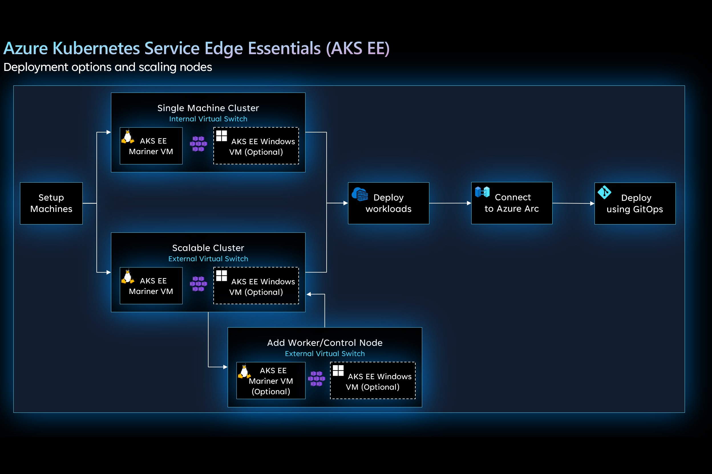

# AKS Edge Essentials clusters and nodes key concepts

This article provides information about AKS Edge Essentials types of cluster deployments, nodes and virtual machines creation.

## Virtual machine nodes

When you create an AKS Edge Essentials deployment, AKS Edge Essentials creates a virtual machine for each deployed node. ASK Edge Essentials manages the lifecycle, configuration and updates of the virtual machines. 

Deployments can only create one Linux VM on a given host machine. This Linux VM can act as both the control plane node and as a worker node based on your deployment needs. This curated VM is based on [CBL-Mariner](https://github.com/microsoft/CBL-Mariner). CBL-Mariner is an internal Linux distribution for Microsoft's cloud infrastructure and edge products and services. CBL-Mariner is designed to provide a consistent platform for these devices and services and enhances Microsoft's ability to stay current on Linux updates. For more information, see [CBL-Mariner security](https://github.com/microsoft/CBL-Mariner/blob/2.0/SECURITY.md). The Linux virtual machine is built on four-point comprehensive premises:

- Servicing updates
- Read-only root filesystem
- No package manager
- Reduced footprint

Running a Windows node is optional and you can create a Windows node if you need to deploy Windows containers. This node runs as a Windows virtual machine based on [Windows 10 IoT Enterprise LTSC 2019](/lifecycle/products/windows-10-iot-enterprise-ltsc-2019). The Windows VM brings all the security features and capabilities of Windows 10. 

You can define the amount of CPU and memory resources that you'd like to allocate for each of the VMs. This static allocation enables you to control how resources are used and ensures that applications running on the host have the required resources.

Finally, AKS Edge Essential doesn't offer dynamic creation of virtual machines. If a node VM goes down, you have to recreate it. That said, if you have a full deployment with multiple control plane nodes and worker nodes, if a VM goes down, Kubernetes moves workloads to an active node.

## Node types

When deploying AKS Edge Essentials nodes, you should specify the `-NodeType` parameter. This parameter indicates the types of workloads can run on this machine, and will tell AKS Edge Essentials to create the corresponding VM. The possible values are **Linux**, **Windows**, or **LinuxAndWindows**.

> [!IMPORTANT]
> Kubernetes control plane components are in Linux, so the first node you deploy must include a Linux node.

## Cluster deployment options

After you set up your machines, you can deploy AKS Edge Essentials in the following configurations:

- **Single machine cluster**: Runs Kubernetes nodes on a single machine to create a single machine cluster. This deployment uses an internal network switch to enable communication across the nodes. This deployment supports only one Linux node and one Windows node, both running on a single machine.
- **Scalable cluster**: Lets you create a multi-node Kubernetes cluster that can be scaled across multiple machines.

  
Once you've created your cluster, you can deploy your applications and connect your cluster to Arc to enable Arc extensions such as Azure Monitor and Azure Policy. You can also choose to use GitOps to manage your deployments.

## Next steps

- [Overview](aks-edge-overview.md)
- [Uninstall AKS cluster](aks-edge-howto-uninstall.md)
