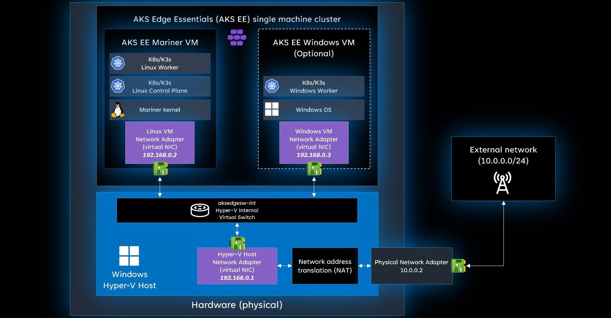
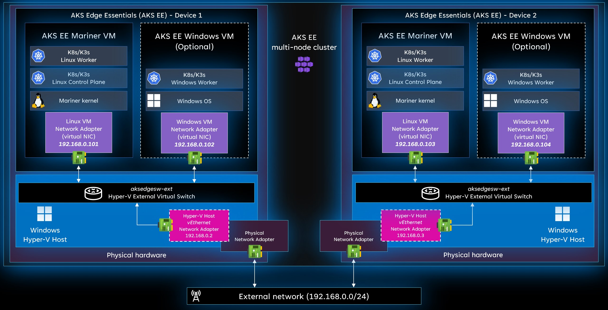

# AKS Edge Essentials networking

This article provides information about how to configure the networking between the Windows host OS and the Linux & Windows nodes virtual machines. For more information about AKS Edge Essentials architecture, see [AKS Edge Essentials overview](./aks-edge-overview.md).

## Networking
This guide assumes that you have control over your network and router (that is, in a home setting). If you are in a corporate environment, we recommend you ask your network administrator for a range of free IP addresses (from the same subnet) that 's reachable on the internet.

To establish a communication channel between the Windows host OS and the Linux & Windows virtual machines, we use Hyper-V networking stack. For more information about Hyper-V networking, see [Hyper-V networking basics](/windows-server/virtualization/hyper-v/plan/plan-hyper-v-networking-in-windows-server#hyper-v-networking-basics). 

There are key networking concepts for AKS Edge Essentials that align with Kubernetes concepts. 

- **Virtual switch**: Hyper-V component that allows virtual machines created on Hyper-V hosts to communicate with other computers. For more information, see [Create and configure a virtual switch with Hyper-V](/windows-server/virtualization/hyper-v/get-started/create-a-virtual-switch-for-hyper-v-virtual-machines?tabs=hyper-v-manager). AKS Edge Essentials support two types of virtual switches:
    - **Internal**: connects to a network that can be used only by the virtual machines running on the Windows host OS that has the virtual switch, and between the host OS and the virtual machines.
    - **External**: connects to a wired, physical network by binding to a physical network adapter. It gives virtual machines access to a physical network to communicate with devices on an external network. In addition, it allows virtual machines on the same Hyper-V server to communicate with each other.

- **Network Address Translation (NAT)**: gives a virtual machine access to network resources using the host computer's IP address and a port through an internal Hyper-V Virtual Switch. Is a networking mode designed to conserve IP addresses by mapping an external IP address and port to a larger set of internal IP addresses. For more information, see [Set up a NAT network](/virtualization/hyper-v-on-windows/user-guide/setup-nat-network).

- **Control plane endpoint IP address**: The Kubernetes control plane is reachable from this IP address. You must provide a single IP that is free throughout the lifetime of the cluster for the Kubernetes control plane.

- **Service IP addresses range**: The Service IP range is a pool of reserved IP addresses used for allocating IP addresses to the Kubernetes services (your Kubernetes services/workloads) for your applications to  be reachable.

- **Virtual machine IP address**: In AKS Edge Essentials, Kubernetes nodes are deployed as specialized virtual machines, which need IP addresses. You must assign free IPs to these VMs.

## Networking by deployment type

Depending if the AKS Edge Essentials is deployed using a **Single Machine Cluster** or a **Scalable Cluster**, we support different types of switches, IP address assignation and configurations, as shown in the following table.

|                     | Single Machine Cluster | Scalable Cluster | 
| ------------------- | ---------------------- | ---------------- |
| **Type of virtual switch** | Internal | External |
| **Virtual switch creation** | Automatic | Manually by user or automatically based on physical net adapter name |
| **IP address assignment** | Automatic – Addresses defined | Static IP addresses configured by user |
| **Outbound connections** | Using NAT | Directly using the physical net adapter | 
| **Inbound connections** | Not reachable | Using the virtual machine IP address | 
| **DNS** | Configurable using `DnsServers` parameter – If not provided, use Windows host DNS servers | Configurable using `DnsServers` parameter – If not provided, use Windows host DNS servers | 
| **Proxy** | Configurable using `http_proxy`, `https_proxy` and `no_proxy` parameters | Configurable using `http_proxy`, `https_proxy` and `no_proxy` parameters | 
| **Offline deployment** | Supported using `InternetDisabled` parameter | Supported using `InternetDisabled` parameter | 
| **Service IP range** | If `ServiceIPRangeSize` parameter is defined, starts at *192.168.0.4* | Both `ServiceIPRangeStart` and `ServiceIPRangeSize` parameters can be defined | 
| **Static MAC Address** | Supported using `MacAddress` parameter | Supported using `MacAddress` parameter |
| **Maximum transmission unit (MTU)** | Supported using `MTU` parameter | Supported using `MTU` parameter |

## Single machine cluster

Single machine deployments use an internal virtual switch to manage the networking. This type of deployment must have a Linux node, and Windows node is optional. The following diagram, shows a single machine deployment architecture using internal virtual switch.



During single machine deployment, AKS Edge Essential creates an internal virtual switch named `aksedgesw-int` and the appropriate virtual network adapters to connect the virtual machines and the Windows host OS. The setup also handles the IP address assignation for the NICs and the creation of the NAT table. IP addresses of the virtual NICs are defined in the following way:

- **Windows host OS**: 192.168.0.1
- **Linux node virtual machine**: 192.168.0.2
- **Windows node virtual machine (optional)**: 192.168.0.3
- **Service IP addresses start**: 192.168.0.4

Finally, by using the NAT component, traffic is able to reach the external network using the physical network adapter. The diagram above shows an external network using the *10.0.0.0/24* IP address family; however this depends on the networking environment that the device is installed.

## Scalable cluster

In scalable cluster deployments, the nodes running inside the different devices must communicate between each other. Hence, all nodes must be connected to the same network. To achieve this node-to-node communication across devices, AKS EE scalable cluster deployments uses external virtual switches. The following diagram, shows a multi machine deployment architecture using external virtual switch.



To start this type of deployment, the user must provide certain networking parameters during deployment:

- **AdapterName**: Name of the physical adapter connected to the external network. You can run the PowerShell `Get-NetAdapter -Physical` command to view the `Name` column for the adapter of your choice.
- **Ip4Address**: Specify the IP address your VM takes. Each node needs its own unique IP address. 

Once deployment is finished, all nodes and Windows host OS will be connected to the external network using same external virtual switch. Because nodes are connected directly to the network, there's no need for a NAT table. The diagram above shows a networking architecture using the *192.168.0.0/24* IP address family; however this depends on the networking environment that the devices are installed.

For more information about Scalable clusters configurations, see [Full Kubernetes deployments in AKS Edge Essentials](./aks-edge-howto-multi-node-deployment.md) and [Scaling out on multiple machines](./aks-edge-howto-scale-out.md).


## Other networking concepts

### DNS
Domain Name System (DNS) translates human-readable domain names (for example, www.microsoft.com) to machine-readable IP addresses (for example, 192.0.2.44). The AKS Edge Essentials Linux virtual machine uses [*systemd*](https://systemd.io/) (system and service manager), so the DNS or name resolution services are provided to local applications and services via the [systemd-resolved](https://www.man7.org/linux/man-pages/man8/systemd-resolved.service.8.html) service. The Windows node uses default Windows networking DNS service.

By default, during AKS EE deployment, the user can provide the DNS Servers list using the `DnsServers` parameter. If no address is provided, the deployment mechanism looks for the Windows host OS DNS servers (check using `ipconfing /all`) and use those server addresses. 

It's possible to check the DNS servers being used for both Linux and Windows nodes. To do so, using an elevated PowerShell session run the following cmdlet: 

- For Linux VM node
    ```powershell
    Invoke-AksEdgeNodeCommand -NodeType Linux -command "resolvectl status"
    ```
    The command's output shows a list of the DNS servers configured for each Linux VM interfaces. In particular, it's important to check the *eth0* interface status, which is the default interface for the AKS EE VM communication. Also, make sure to check the IP addresses of the **Current DNS Server** and **DNS Servers** fields of the list. If there's no IP address, or the IP address isn't a valid DNS server IP address, then the DNS service won't work.

- For Windows VM node
    ```powershell
    Invoke-AksEdgeNodeCommand -NodeType Windows -command "ipconfig /all"
    ```
    The command's output shows a list of the Windows VM network interfaces configured. In particular, it's important to check the *Ethernet adapter vEthernet (Ethernet)* interface status, whchi is the default interface for the AKS EE VM communication. Also, make sure to check the IP addresses of the **DNS Servers**  field of the list. If there's no IP address, or the IP address isn't a valid DNS server IP address, then the DNS service won't work.

### Proxy
A proxy server is a dedicated software acting as a gateway between a client and the rest of the Internet. It processes networks requests as an intermediary – when you connect to a proxy server, your computer sends requests to the server rather than directly to the recipient. AKS Edge Essentials supports setting up proxy servers for both the Linux and Windows virtual machines. 

By default, during AKS EE deployment, the user can provide the proxy configurations using the `Proxy.Http`, `Proxy.Https` and `Proxy.No` parameters. If no parameters are provided, the deployment mechanism sets up the `no_proxy` flag with the necessary Kubernetes internal networking. 

- For Linux VM node
    ```powershell
    Invoke-AksEdgeNodeCommand -NodeType Linux -command 'env | grep proxy'
    ```
- For Windows VM node
    ```powershell
    Invoke-AksEdgeNodeCommand -NodeType Windows -command 'netsh winhttps show proxy'
    ```

### Static MAC Address
Hyper-V allows you to create virtual machines with a **static** or **dynamic** MAC address. During AKS EE virtual machines creation, the user can provide the VM MAC address using the `MacAddress` parameter. If no value is provided, the MAC address is randomly generated and stored locally to keep the same address across virtual machine, or Windows host reboots.  To query the AKS EE virtual machines MAC address, you can use the following command.

- For Linux VM node
    ```powershell
    Get-AksEdgeNodeAddr -NodeType Linux
    ```
- For Windows VM node
    ```powershell
    Get-AksEdgeNodeAddr -NodeType Windows
    ```

## Next steps

- [Overview](aks-edge-overview.md)
- [Uninstall AKS cluster](aks-edge-howto-uninstall.md)
