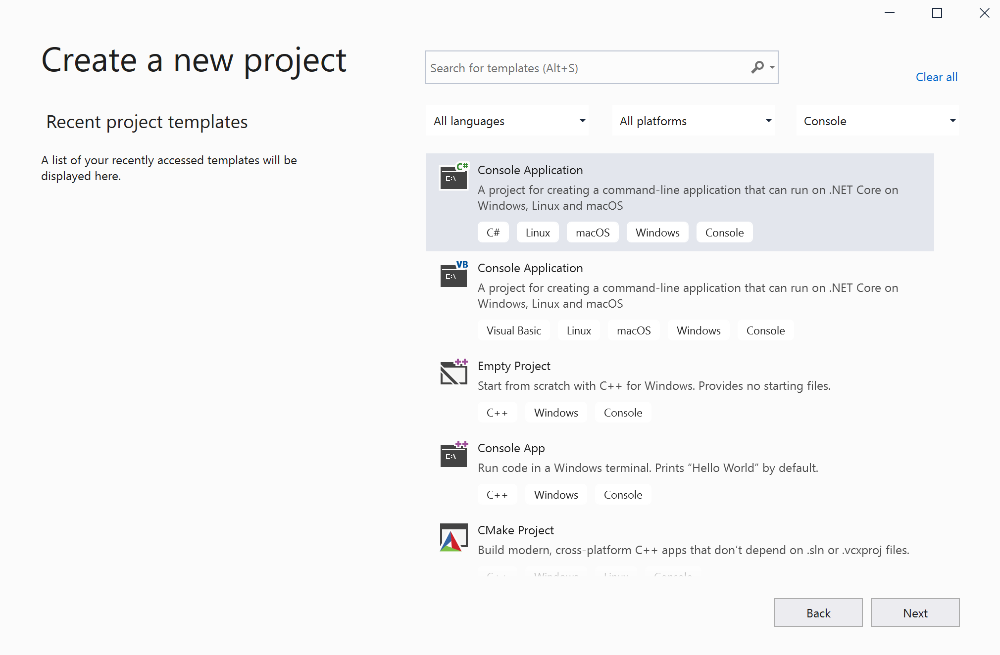
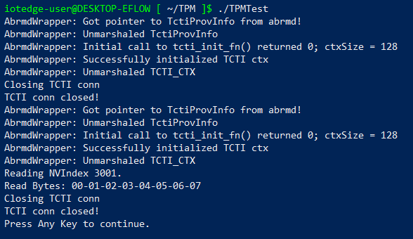

# dTPM access for AKS Edge Essentials

A [Trusted platform module (TPM)](/windows/security/information-protection/tpm/trusted-platform-module-top-node) chip is a secure crypto-processor that is designed to carry out cryptographic operations. This technology is designed to provide hardware-based, security-related functions. You can enable or disable the TPM passthrough feature that allows the AKS Edge Essentials virtual machine to use the Windows host OS TPM. The TPM passthrough feature provides read-only access to cryptographic keys stored inside the TPM

This article describes how to develop a sample code in C# to read cryptographic keys stored inside the device's discrete TPM.

> [!NOTE]
> The access to the TPM keys is limited to read-only. If you want to write keys to the TPM, you need to do it from the Windows host OS.

## Prerequisites

- A Windows host OS with a TPM or vTPM (if using Windows host OS virtual machine).

- Enable TPM access from the CBL-Mariner virtual machine with TPM passthrough enabled. In your `aksedge-config` file, in the machines section, set the `Machine.LinuxNode.TpmPassthrough` as True. You can enable or disable TPM access only when creating a new deployment. Once you set the flag, it can't be changed, unless you remove the deployment or node.

- Ensure that the NV index (default index=3001) is initialized with 8 bytes of data. The default AuthValue used by the sample is {1,2,3,4,5,6,7,8} which corresponds to the NV (Windows) Sample in the TSS.MSR libraries when writing to the TPM. All index initialization must take place on the Windows Host before reading from the CBL-Mariner VM. For more information about TPM samples, see [TSS.MSR.](https://github.com/microsoft/TSS.MSR).

> [!CAUTION]
> Enabling TPM passthrough to the virtual machine may increase security risks.

## Create a sample dTPM executable

The following steps show you how to create a sample executable to access a discrete TPM index from the CBL-Mariner VM.

1. Open Visual Studio 2019 or 2022. Select **Create a new project**. Choose **Console App** in the list of templates then select **Next**.

    

1. Fill in the **Project Name**, **Location** and **Solution Name** fields then select **Next**.

1. Choose a target framework. The latest .NET 6.0 LTS version is preferred. After choosing a target framework, select **Create**. Visual Studio creates a new console app solution.

1. In **Solution Explorer**, right-click the project name and select **Manage NuGet Packages**.

1. Select **Browse** and then search for `Microsoft.TSS`. For more information about this package, see [Microsoft.TSS](https://www.nuget.org/packages/Microsoft.TSS). Choose the **Microsoft.TSS** package from the list then select **Install**.

1. Edit the *Program.cs* file and replace the contents with the [tpm-read-nv sample code - Program.cs](https://github.com/Azure/iotedge-eflow/blob/main/samples/tpm-read-nv/Program.cs).

1. Select **Build** > **Build solution** to build the project.  Verify the build is successful.

1. In **Solution Explorer**, right-click the project then select **Publish**.

1. In the **Publish** wizard, choose **Folder** > **Folder**. Select **Browse** and choose an output location for the executable file to be generated.  Select **Finish**. After the publish profile is created, select **Close**.

1. On the **Publish** tab, select **Show all settings** link. Change the following configurations then select **Save**.
    - Target Runtime:  **linux-x64**.
    - Deployment mode: **Self-contained**.

1. Select **Publish** then wait for the executable to be created.

If publish succeeds, you should see the new files created in your output folder.

## Copy and run the executable

Once the executable file and dependency files are created, you need to copy the folder to the CBL-Mariner virtual machine. The following steps show you how to copy all the necessary files and how to run the executable inside the CBL-Mariner virtual machine.

1. Start an elevated *PowerShell* session using **Run as Administrator**.

1. Change directory to the parent folder that contains the published files.
    For example, if your published files are under the folder *TPM* in the directory `C:\Users\<User>`.  You can use the following command to change to the parent folder.

    ```powershell
    cd "C:\Users\<User>"
    ```

1. Create a *tar* file with all the files created in previous steps. For more information about PowerShell *tar* support, see [Tar and Curl Come to Windows](/virtualization/community/team-blog/2017/20171219-tar-and-curl-come-to-windows).
    For example, if you have all your files under the folder *TPM*, you can use the following command to create the *TPM.tar* file.

    ```powershell
     tar -cvzf TPM.tar ".\TPM"
    ```

1. Once the *TPM.tar* file is created successfully, use the `Copy-AksEdgeNodeFile` cmdlet to copy the *tar* file created to the CBL-Mariner VM. For example, if you have the *tar* file name *TPM.tar* in the directory `C:\Users\<User>`. you can use the following command to copy to the CBL-Mariner VM.

    ```powershell
    Copy-AksEdgeNodeFile -fromFile "C:\Users\<User>\TPM.tar" -toFile "/home/aksedge-user/" -pushFile
    ```

1. Run the following command to extract all the content from the *tar* file.

   ```powershell
   Invoke-AksEdgeNodeCommand -NodeType "Linux" -command "tar -xvzf TPM.tar"
   ```

1. After extraction, Add executable permission to the main executable file. For example, if your project name was *TPMRead*, your main executable is named *TPMRead*. Run the following command to make it executable.

    ```powershell
    Invoke-AksEdgeNodeCommand -NodeType "Linux" -command "cd TPM && chmod +x TPMRead"
    ```

1. To solve an [ICU globalization issue](https://github.com/dotnet/core/issues/2186#issuecomment-472629489), run the following command. For example, if your project name is *TPMRead* run:

    ```powershell
     Invoke-AksEdgeNodeCommand -NodeType "Linux" -command "cd TPM && sed -i '/`"configProperties`": /a \\t`"System.Globalization.Invariant\`": true,' TPMRead.runtimeconfig.json"
    ```

1. The last step is to run the executable file. For example, if your project name is *TPMRead*, run the following command:

    ```powershell
    Invoke-AksEdgeNodeCommand -NodeType "Linux" -command "cd TPM && ./TPMRead"
    ```

    You should see an output similar to the following.


## Next steps

- [Overview](aks-edge-overview.md)
- [Uninstall AKS cluster](aks-edge-howto-uninstall.md)
