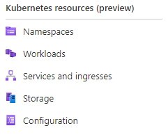

# Connect your AKS on Windows cluster to Arc

In this section we will connect your AKS-IoT cluster to [Azure Arc](/azure/azure-arc/kubernetes/overview) so that you can monitor the health of your cluster on Azure Portal.

> [!IMPORTANT]
> If you do not have a cluster installed, create a [single node cluster](aks-lite-howto-single-node-deployment.md) and follow the steps to deploy.

You will need an Azure subscription and have either the `Owner` role or a combination of `Contributor` and `User Access Administrator` roles. You can check your access level by navigating to your subscription, clicking on **Access control (IAM)** on the left-hand side of the Azure portal and then clicking on **View my access**. Read the [official Azure docs](/azure/azure-resource-manager/management/manage-resource-groups-portal) for more information on managing resource groups.

Execute these steps on your **primary machine**.

> [!NOTE]
> If you would like to use **an existing service principal** or you want to use **PowerShell 7 with the new API** to connect to Arc, click [**here**](/aks-lite-howto-more-configs.md) for the instructions.

## Step 1: Configure your Azure environment

In your `Bootstrap` folder (inside the Github respository folder downloaded as .zip and extracted), open `aide-userconfig.json` or `aksiot-userconfig.json`(in earlier released versions).

```cmd
notepad.exe aide-userconfig.json
```

or (in earlier released versions)

```cmd
notepad.exe aksiot-userconfig.json
```

There, enter in the parameters under `Azure` with the appropriate information.

```powershell
    "Azure": {
        "SubscriptionName":"Visual Studio Enterprise Subscription",
        "SubscriptionId": "",
        "TenantId":"",
        "ResourceGroupName": "aksiotpreview-rg",
        "ServicePrincipalName" : "aksiot-sp",
        "Location" : "EastUS",
        "ClusterName": "",
        "Auth": {
            "spId" : "",
            "password" : ""
        }
    }
```

> [!NOTE]
> If you would like to use an existing service principal instead of creating a new one, specify your service principal ID and password under "Auth". Read more about configuring the JSON parameters [here](/bootstrap/Modules/ArcForWinIoT/README.md).

Once the JSON has been edited and saved,  run `Read-ArcIotUserConfig` to read the updated json configuration. You can verify the values using `Get-ArcIotUserConfig`. Alternatively, you can reopen `LaunchPrompt.cmd` to use the updated json configuration.

```powershell
Read-ArcIotUserConfig
Get-ArcIotUserConfig
```

> [!IMPORTANT]
> Any time you modify `aide-userconfig.json` (or `aksiot-userconfig.json`), run `Read-ArcIotUserConfig` to reload, or close and re-open `LaunchPrompt.cmd`.

| Attribute | Value type      |  Description |
| :------------ |:-----------|:--------|
|SubscriptionName | `string` | The name of your Azure subscription. You can find this on the Azure portal. The default is `Visual Studio Enterprise Subscription`. |
|ResourceGroupName | `string` | Name of the Azure resource group to host your Azure resources for AKS-IoT. **We will create a new resource group with this name under your subscription.** Default value is `aksiotpreview-rg`.|
|ServicePrincipalName | `string` | Name of the Azure Service Principal to use as credentials. **We will create a new Service Principal with this name under your subscription.** We will use this Service Principal to connect your cluster to Arc. Default value is `aksiot-sp`.|
|Location | `string` | The location we will create your resource group. Leave this as `EastUS`. |
|ClusterName | `string` | The name of the cluster for the Arc Connection. Default is hostname-distribution (abc-k8s or abc-k3s) |

## Step 2: Connect your cluster to Arc

> [!IMPORTANT]
> If you already have Azure CLI installed, please run `az upgrade` to ensure your `azure-cli` and `extensions` are up-to-date.

```cmd
az upgrade
```

```json
{
  "azure-cli": "2.39.0",
  "azure-cli-core": "2.39.0",
  "extensions": {
    "connectedk8s": "1.3.1",
    "connectedmachine": "0.5.1",
    "customlocation": "0.1.3",
    "k8s-extension": "1.3.3"
  }
}
```

> [!NOTE]
> If you already have setup your subscription and have service principal credentials defined in the json file (Azure.Auth.Spid and AzureAuth.password), you can skip to 3.

1. In your browser, log into the Azure Portal with your credentials.

2. Run `Initialize-ArcIot` and sign into Azure if prompted. This will install Azure CLI (if not already installed), enable the required resource providers for your subscription, create a resource group based on the name you specified to host the Azure resources, and create a service principal based on the name you specified to use as credentials. The credentials will be stored as `.xml` in `$env:USERPROFILE\.arciot` directory.

    ```powershell
    Initialize-ArcIot
    ```

    > [!NOTE]
    > We use your Azure credentials to create the resource group and service principal. The service principal is scoped to your resource group and we will use the service principal credentials to connect your cluster to Arc.

3. Run `Connect-ArcIotK8s` to connect the cluster to Arc. This will login using your service principal, enable the cluster-connect features to view your cluster's Kubernetes resources in Arc, and generate a bearer token `servicetoken.txt` in the `bootstrap` folder.

    ```powershell
    Connect-ArcIotK8s
    ```

    This step may take a while and the powershell may be stuck on "Establishing Azure Connected Kubernetes for `your cluster name`", but if you navigate to your resource group on Azure portal, you should see your cluster as a resource. When the powershell command is done running, click on your cluster.


## Step 3: View cluster resources

1. On the left panel, click on the "Namespaces" blade under "Kubernetes resources (preview)"

    

2. To view your Kubernetes resources, you need a bearer token.

    

3. Go to your `servicetoken.txt` file, copy the full string, and paste it into Azure portal.

    

4. Now you can look at resources on your cluster. Here's the "Workloads" blade, showing the same as `kubectl get pods --all-namespaces`

    

## Use GitOps with Arc-enabled Kubernetes

Explore using GitOps for remote deployment and continuous integration [here](/docs/gitops.md).

## Arc Extensions

Explore using Arc extensions like Azure Monitor and Azure Policy [here](/docs/arc-extensions.md).

## Disconnect from Arc

Run `Disconnect-ArcIotK8s` to disconnect your cluster from Azure Arc. For a complete clean-up, delete the service principal and resource group we created for this evaluation.

```powershell
Disconnect-ArcIotK8s
```

## Next steps

- You can now try other Arc-enabled services as described [here](aks-lite-howto-enable-arc-services.md)
- [Overview](aks-lite-overview.md)
- [Uninstall AKS cluster](aks-lite-howto-uninstall.md)

<!--
Remove all the comments in this template before you sign-off or merge to the 
main branch.
-->
