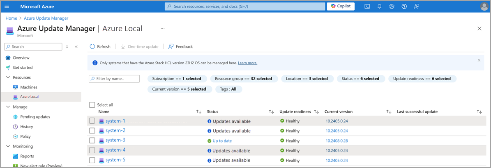
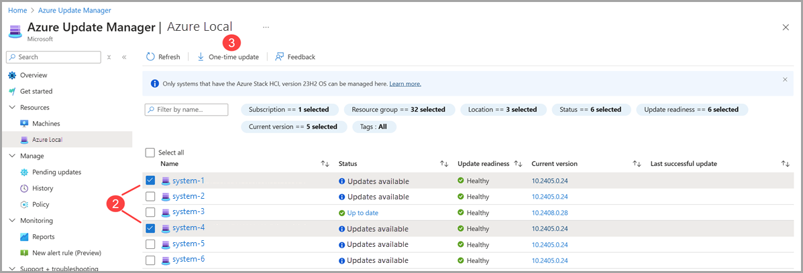
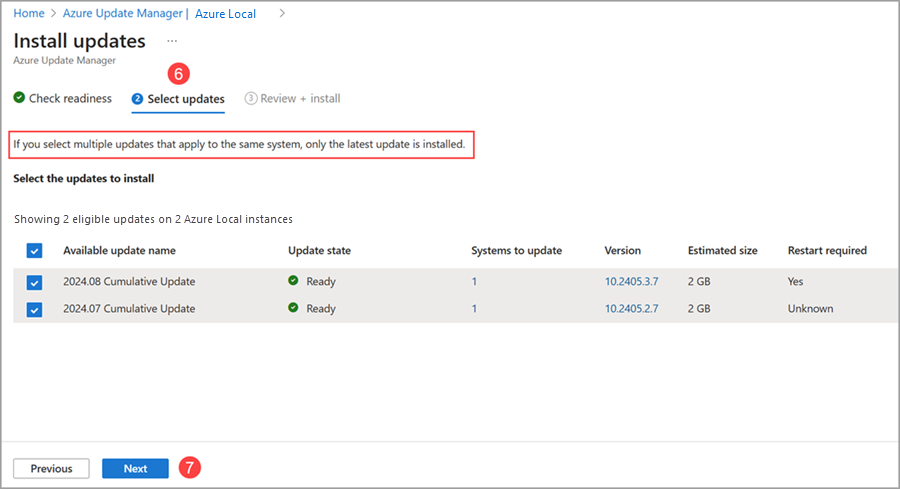
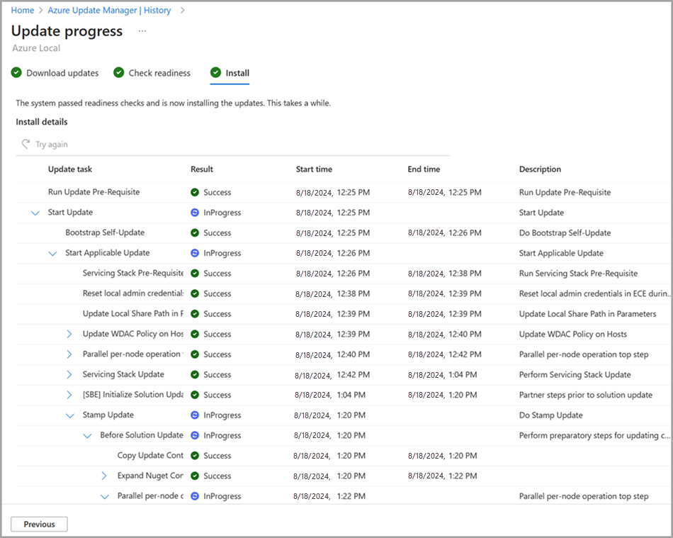
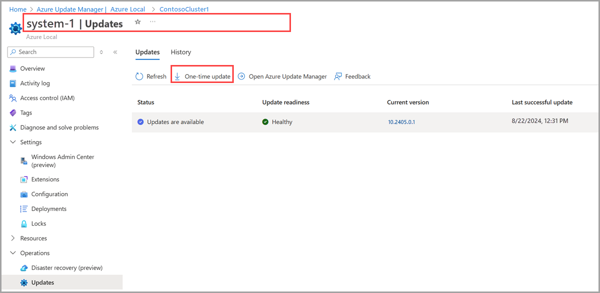
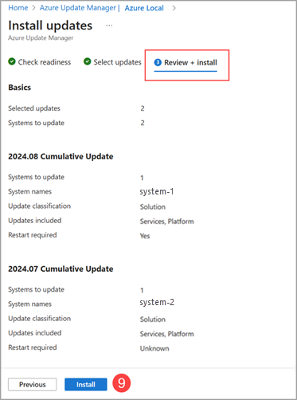
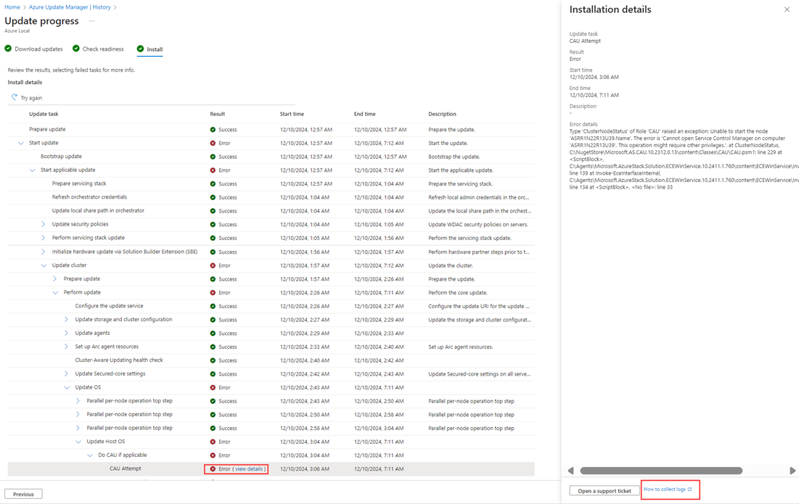
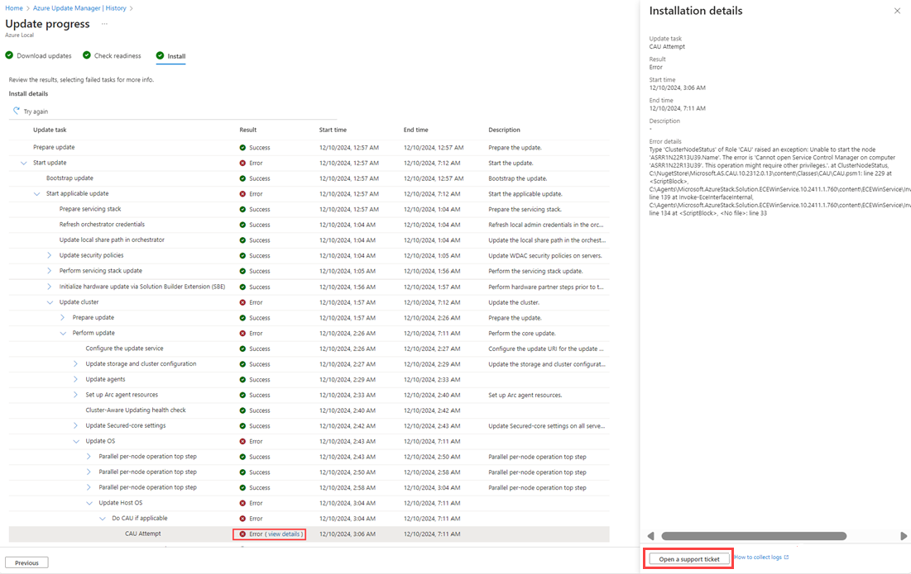

# Use Azure Update Manager to update your Azure Local, version 23H2

[!INCLUDE [applies-to](../includes/hci-applies-to-23h2.md)]

[!INCLUDE [IMPORTANT](../includes/hci-applies-to-23h2-cluster-updates.md)]

This article describes how to use Azure Update Manager to find and install available updates on Azure Local. Additionally, we provide guidance on how to review, track progress, and browse the history of system updates.

## About Azure Update Manager

Azure Update Manager is an Azure service that allows you to apply, view, and manage updates for each of your Azure Local machines. You can monitor your entire infrastructure, including remote and branch offices, and perform updates at scale.

Here are some benefits of the Azure Update Manager:

- The update agent checks Azure Local for update health and available updates daily.
- You can view the update status and readiness for each system.
- You can update multiple systems at the same time.
- You can view the status of updates while they're in progress.
- Once complete, you can view the results and history of updates.

## About readiness checks

Readiness checks are essential for ensuring that your updates are applied smoothly, that your systems are up-to-date, and that your systems are functioning correctly. These results are from the update readiness checks that are executed *after* the update content is downloaded and *before* it begins to install. You receive the results of these readiness checks from system health checks performed **every 24 hours**. There are three types of readiness checks: Critical, Warning, and Informational.

- **Critical**: Readiness checks that prevent you from applying the update. This status indicates issues that must be resolved before proceeding with the update.
- **Warning**: Readiness checks that also prevent you from applying the update, but you can bypass these using [PowerShell](../update/update-via-powershell-23h2.md). This status indicates potential issues that might not be severe enough to halt the update, but should be addressed to ensure a smooth update process.
- **Informational**: Readiness checks that don't block the update. This status provides information about the system's state and any potential issues that shouldn't affect the update process directly. These checks are for your awareness and might not require immediate action.

## Prerequisites

- An Azure Local, version 23H2 system deployed and registered with Azure.

For Azure Local, Azure Update Manager is supported only in the regions where Azure Local is supported. For more information, see [List of supported Azure Local regions](../concepts/system-requirements-23h2.md#azure-requirements).

## Browse for system updates

To browse for available system updates using Azure Update Manager, follow these steps:

1. Sign into [the Azure portal](https://portal.azure.com) and go to **Azure Update Manager**.

2. Under the **Resources** dropdown, select **Azure Local**.
   - Filter by Subscription, Resource group, Location, Status, Update readiness, Current version, and/or Tags to view a list of systems.

3. In the systems list, view the update Status, Update readiness, Current version, and the date and time of the Last successful update.

    > [!NOTE]
    > It can take up to 15 minutes for system values to update in the Azure portal.

    

## Install system updates

To install system updates using Azure Update Manager, follow these steps:

1. Sign into [the Azure portal](https://portal.azure.com) and go to **Azure Update Manager**.

2. Under the **Resources** dropdown, select **Azure Local**.

3. Select one or more systems from the list, then select **One-time Update**.

    

4. On the **Check readiness** page, review the list of readiness checks and their results.

    - You can select the links under **Affected systems** to view more details and individual system results. For information on the check types, see [About readiness checks](azure-update-manager-23h2.md#about-readiness-checks).

5. Select **Next**.

    

6. On the **Select updates** page, specify the updates you want to include in the deployment.
   1. View and select the available updates to install on your Azure Local machines.
   2. Select the **Version** link to view the update components, versions, and update release notes.

7. Select **Next**.

    

8. On the **Review + install** page, verify your update deployment options, and then select **Install**.

    

   You should see a notification that confirms the installation of updates. If you don’t see the notification, select the **notification icon** in the top right taskbar.

    

## Track system update progress and history

When you install system updates via Azure Update Manager, you can check the progress of those updates.

> [!NOTE]
> After you trigger an update, it can take up to 15 minutes for the update run to show up in the Azure portal.

To view the progress of your update installation, and completion results, follow these steps:

1. Sign into [the Azure portal](https://portal.azure.com) and go to **Azure Update Manager**.

2. Under the **Manage** dropdown, select **History**.

3. Select an update run that you want to monitor or review:
    - Select an **In Progress** update to monitor a current updates progress.
    - Select a **Failed to update** or **Successfully updated** update to review historical results.

    

4. On the **Download updates** page, review the progress of the download and preparation, and then select **Next**.

5. On the **Check readiness** page, review the list of readiness checks and their results.
    - You can select the links under **Affected systems** to view more details and individual system results. For information on the check types, see [About readiness checks](azure-update-manager-23h2.md#about-readiness-checks).

6. Select **Next**.

7. On the **Install** page, review the progress of the update installation.

    

## Update via the Azure Local resource page

In addition to using Azure Update Manager, you can update individual systems from the Azure Local resource page.

To install updates on a single system from the resource page, follow these steps:

1. Sign into [the Azure portal](https://portal.azure.com) and go to **Azure Update Manager**.

2. Under the **Resources** dropdown, select **Azure Local**.

3. Select the system name from the list.

4. Select the update and then select **One-time update**.

      

5. On the **Check readiness** page, review the list of readiness checks and their results.
    - You can select the links under **Affected systems** to view more details and individual system results. For information on the check types, see [About readiness checks](azure-update-manager-23h2.md#about-readiness-checks).

6. Select **Next**.

7. On the **Select updates** page, specify the updates you want to include in the deployment.
   1. View and select the available updates to install on your Azure Local machines.
   2. Select the **Version** link to view the update components and their versions.
   3. Select the Details, **View details** link, to view the update release notes.

8. Select **Next**.

9. On the **Review + install** page, verify your update deployment options, and select **Install**.

    

You should see a notification that confirms the installation of updates. If you don’t see the notification, select the **notification icon** in the top right taskbar.

## Update your hardware via Windows Admin Center

In addition to system updates using Azure Update Manager or the Azure Local resource page, you can use Windows Admin Center to check for and install available hardware (firmware and driver) updates for your Azure Local.

Here's an example of the Windows Admin Center updates tool for systems running Azure Local, version 23H2.

## Troubleshoot updates

To resume a previously failed update run, browse to the failed update and select the **Try again** button. This functionality is available at the Download updates, Check readiness, and Install stages of an update run.

If you're unable to successfully rerun a failed update or need to troubleshoot an error further, follow these steps:

1. Select the **View details** of an error.

2. When the details box opens, you can download error logs by selecting the **Download logs** button. This prompts the download of a JSON file.

    

3. Additionally, you can select the **Open a support ticket** button, fill in the appropriate information, and attach your downloaded logs so that they're available to Microsoft Support.

    

For more information on creating a support ticket, see [Create a support request](/azure/azure-portal/supportability/how-to-create-azure-support-request#create-a-support-request).

To troubleshoot other update run issues, see [Troubleshoot updates](../update/update-troubleshooting-23h2.md).

## Next steps

Learn to [Understand update phases](./update-phases-23h2.md).

Learn more about how to [Troubleshoot updates](./update-troubleshooting-23h2.md).
