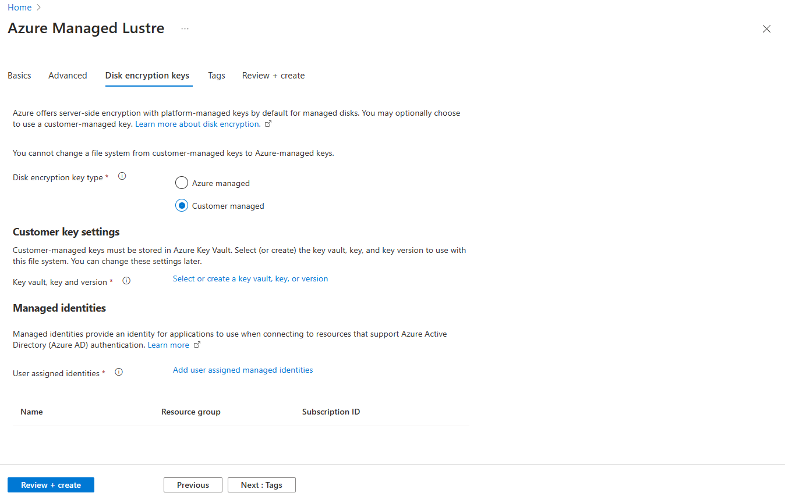
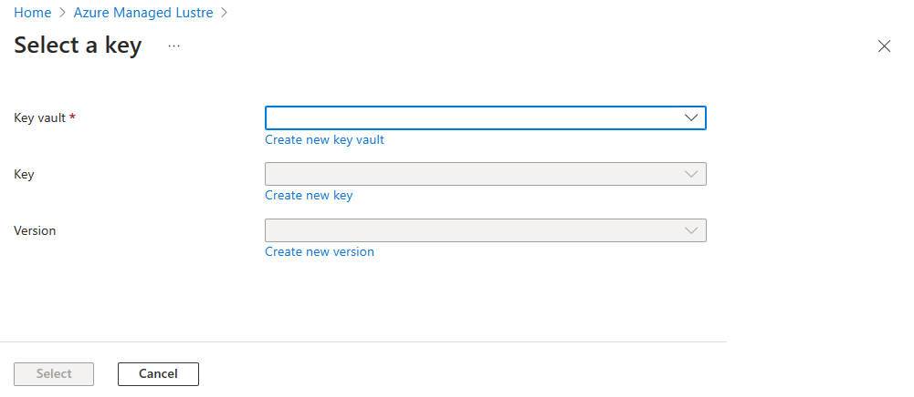

# Create an Azure Managed Lustre file system

If you'd prefer to use Azure Resource Manager templates to create your file system, see [Create a file system using Azure Resource Manager templates](create-file-system-resource-manager.md).

This article describes how to create an Azure Managed Lustre file system in the Azure portal.

## Prerequisites

The following configuration options can't be changed after you create your file system:

* The size of the file system.
* The option to use an integrated Azure Blob Storage container.
* The choice between customer-managed or system-generated encryption keys for storage.

Plan these items carefully, and configure them correctly when you create your Azure Managed Lustre file system.

## Sign in to the Azure portal

1. Sign in to [the Azure portal](https://portal.azure.com).

1. Type **Azure Managed Lustre** in the search box, and press **Enter**.

1. On the **Azure Managed Lustre** page, select **+ Create**.

This starts the **Create** wizard.

## Basics

On the **Basics** tab, enter the following information:

### Project details

1. Select the subscription to use for Azure Managed Lustre.

1. In **Resource group**, select a resource group, or create a new one to use for this installation.

1. **Region** and **Availability zone**: Select the Azure region and availability zone (if the region supports zones) for your file system.

   For best performance, create your Azure Managed Lustre file system in the same region and availability zone as your client machines.

   
   
### File system details

Set the name and capacity of the Azure Managed Lustre file system:

1. **File system name**: Choose a name to identify this file system in your list of resources.

2. **File system type**: Shows **Durable, SSD**, the type of infrastructure that's available for the file system.

3. **Storage and throughput**: Use these settings to set the size of your file system.

   There are two factors that determine your file system size: the amount of storage allocated for your data (storage capacity), and the maximum data transfer rate (throughput). When you select one of these options, the other values are calculated based on the  **Throughput per TiB** setting for your file system type.

  To set your Azure Managed Lustre file system size, do these steps:
  
1. Choose either **Storage capacity** or **Maximum throughput**.

  1. Enter a value in the writeable field - either your desired storage capacity (in TiB) if you selected **Storage capacity**, or your desired maximum throughput (in MB/second) if you selected **Maximum throughput**.

     > [!NOTE]
     > These values are rounded up to meet incremental size requirements. They are never rounded down, so make sure you check the final configuration to make sure it's cost-effective for your workload.

     

Currently the following throughput configurations are available:

| Throughput per TiB storage | Storage Min| Storage Max| Increment|
|-----------|-----------|-----------|-----------|
| 40 MB/second | 48 TB | 768 TB | 48 TB|
| 125 MB/second | 16 TB | 128 TB | 16 TB |
| 250 MB/second | 8 TB | 128 TB | 8 TB |
| 500 MB/second | 4 TB | 128 TB | 4 TB |

> [!NOTE]
> Azure Managed Lustre can support storage capacities up to 2.5PB upon request. To enable this, please [open a support ticket](https://ms.portal.azure.com/#view/Microsoft_Azure_Support/HelpAndSupportBlade/~/overview)
> If you need cluster sizes greater than 2.5PB please also [open a support ticket](https://ms.portal.azure.com/#view/Microsoft_Azure_Support/HelpAndSupportBlade/~/overview) to discuss additional options.
### Networking

In the **Networking** section:

1. Enter the virtual network and subnet that you configured earlier in [Network prerequisites](amlfs-prerequisites.md#network-prerequisites):

1. **Virtual network**: Select or create the network for your Azure Managed Lustre file system.

   1. **Subnet**: Select or create the subnet to use for file system interaction.

   The Azure Managed Lustre file system uses a dedicated virtual network and one subnet. The subnet contains the Lustre Management Service (MGS), which handles all of the client interaction with the Azure Managed Lustre system.

   You can open the **Manage subnet configuration** link to make sure the subnet meets your network requirements. The network should have enough available IP addresses to handle the file system's load and any additional IP addresses required by any other services that are co-located with the file system.

   Also make sure you completed all access settings to enable the subnet to access the needed Azure services.

   To review networking requirements, see [Network prerequisites](amlfs-prerequisites.md#network-prerequisites) for more information about network sizing and other configuration options.

   
   
When you finish entering the **Basic** settings, select **Next: Advanced** to continue.

> [!NOTE]
> Moving an Azure Virtual Network Manager instance is not currently supported. The existing virtual network manager instance might be deleted and another created in a new location using the Azure Resource Manager template.

## Advanced

Use the **Advanced** tab to set up Blob Storage integration and customize the maintenance window.

### Blob integration

If you want to use integrated Azure Blob storage with your Azure Managed Lustre file system, you must specify it in the **Blob integration** section when you create the file system. You can't add an HSM-integrated blob container to an existing file system.

Azure Managed Lustre is customized to work seamlessly with Azure Blob Storage. You can specify a populated blob container to make its data accessible from your Azure Managed Lustre file system, or specify an empty container that you populate with data or use to store your output. All setup and maintenance is done for you. You just need to specify which blob container to use.

Integrating blob storage when you create a file system is optional, but it's the only way to use [Lustre Hierarchical Storage Management (HSM)](https://doc.lustre.org/lustre_manual.xhtml#lustrehsm) features. If you don't want the benefits of Lustre HSM, you can import and export data for the Azure Managed Lustre file system by using client commands directly.

To configure blob integration:

1. To configure storage access and create containers for blob integration, complete the [blob integration prerequisites](amlfs-prerequisites.md#blob-integration-prerequisites-optional).

   To learn which types of accounts are compatible and what access settings need to be configured, see [Supported storage account types](amlfs-prerequisites.md#supported-storage-account-types).

   The storage account doesn't need to be in the same subscription that you use for the Azure Managed Lustre file system.

1. Select the **Import/export data from blob** check box.

1. Specify the **Subscription** and **Storage account**, and **Container** to use with your Lustre file system.

1. In the **Logging container** field, select the container you created to store import/export logs. The logs must be stored in a separate container from the data container, but in the same storage account.

1. In **import prefix**, optionally supply a file path that matches data files in your container. The default prefix, **/**, imports all files from the data container.

   When you create the Azure Managed Lustre file system, contents that match this prefix are added to a metadata record in the file system. When clients request a file, its contents are retrieved from the blob container and stored in the file system.

   If you don't want to import files from the blob container, set an import prefix that doesn't match any files in the container.

* If you use a hierarchical blob storage service like NFSv3-mounted blob storage, you can think of the prefix as a file path. Items under the path are included in the Azure Managed Lustre file system.

   * If you use your blob container as a non-hierarchical object store, you can also think of the import prefix as a search string that is compared with the beginning of your blob object name.

   For more information, see [Filter blob imports](blob-integration.md#filter-blob-imports).

   You can't change this field after you create the Azure Managed Lustre file system.

   
   
### Maintenance window

To allow Azure staff to maintain your Azure Managed Lustre file system, they need access to the file system to run diagnostics, update software, and troubleshoot any problems. Use the **Maintenance window** setting to set a time when the system can be disrupted for routine service.

Tasks that are active during this service might fail, or might only be delayed. Testing is ongoing to determine this behavior.

After the general availability (GA) release, maintenance is performed less than once a month. Routine software upgrades happen about six times a year, and approximately five other update tasks might be needed to address vulnerabilities or critical bugs over the same time.

When you finish entering **Advanced settings**:

* If you want to use your own encryption keys for your Azure Managed Lustre file system storage, select **Next: Disk encryption keys**.
* If you don't want to use your own encryption keys, select **Review + create**. You're ready to create your file system.

> [!NOTE]
> You cannot change between Microsoft-managed keys and customer-managed keys after your create the file system.

## Disk encryption keys (optional)

If you want to manage the encryption keys used for your Azure Managed Lustre file system storage, supply your Azure Key Vault information on the **Disk encryption keys** page. The key vault must be in the same region and in the same subscription as the cache.

You can skip this section if you don't need customer-managed keys. Azure encrypts data with Microsoft-managed keys by default. For more information, see [Azure storage encryption](/azure/storage/common/storage-service-encryption).

> [!NOTE]
> You cannot change between Microsoft-managed keys and customer-managed keys after creating the file system.

For a complete explanation of the customer-managed key encryption process, see [Use customer-managed encryption keys with Azure Managed Lustre](customer-managed-encryption-keys.md).

To use customer-managed encryption keys with your Azure Managed Lustre file system, do these steps:

1. For **Disk encryption key type**, select **Customer managed**.

   The key vault specification fields appear.

1. Under **Customer key settings**, open the **Select or create a key vault, key, or version** link.

   
   
1. On the **Select a key** screen, select the **Key vault**, **key**, and **Version** of the key to use for this file system. Then choose **Select**.

   You can create a new key vault, key, and key version from this page. The key must be a 2048-bit RSA key, and must be stored in Azure Key Vault.

   
   
      **Customer key settings** now displays your key vault, key, and version.

   
   
1. In **Managed identities**, specify one or more user-assigned managed identities to use for this file system. Each identity must have access to the key vault in order to successfully create the Azure Managed Lustre file system.

   > [!NOTE]
   > You cannot change the assigned identity after you create the file system.

   To learn more, see [What are managed identities for Azure resources?](/azure/active-directory/managed-identities-azure-resources/overview).

When you finish entering customer key settings and managed identities, select **Review + create** to continue.

## Review settings and create the file system

On the **Review + create** tab, when a **Validation passed** message appears, select **Create** to begin creating the file system.

Your Azure Managed Lustre file system should appear in your portal **Resources** page within 30 minutes.

## Next steps

* Learn how to [connect clients to your new Azure Managed Lustre file system](connect-clients.md)
