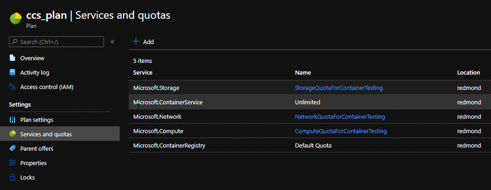

# Install and offer the Azure Kubernetes Service on Azure Stack Hub

`Summary.`

## Download AKS base Image

The AKS Service needs a special VM image referred to the "AKS base Image". The AKS service will not work without the correct image version available in the local ASH marketplace. The image is meant to be used by the AKS service, not to be used by tenants to create individual VMs. The image will not be visible to tenants in the Marketplace. This is a task that needs to be done alongside every Azure Stack Hub Update. Every time there is a new update there will be a new AKS base image associated with the AKS Service. Here are the steps:

1.  Using the administrator portal, go the Marketplace management blade and select "Add from Azure", type "AKS" in the search box, locate and download Linux "AKS Base Ubuntu Image version 2021.xx.xx" and Windows AKS base image select version "xxxx.xxxx.xxxxxx" \<TODO: update version and image\>

    

1.  If your instance is disconnected, please follow the instructions in the article "[Download Marketplace items to Azure Stack Hub](/azure-stack/operator/azure-stack-download-azure-marketplace-item)" to download the two items mentioned from the marketplace in Azure and upload them to your Azure Stack Hub instance.

## Create Plans and Offers

To allow tenant users to use the AKS Service the operator needs to make it available through a plan and an offer.

1.  Using the Admin Portal create a Plan with the "Microsoft.Container" service. Note that there are no specific quota for this service, it uses the quotas available for the Compute, Network, and Storage services:

    

2.  Again use the Admin portal to create an offer that contains the plan created in the prior step:

    

## Monitor the AKS Service and act on Alerts

1.  Using the Admin Portal you can access the Azure Kubernetes Service under the "Administration" group.
2.  Once you open it, you will find the "Alerts" blade, select it to see any alerts:

    

1.  Alerts will show in the "Alerts" blade, you will be able to take action on them if need to:

## Next steps

[Learn more about the AKS on Azure Stack Hub](aks-overview.md)