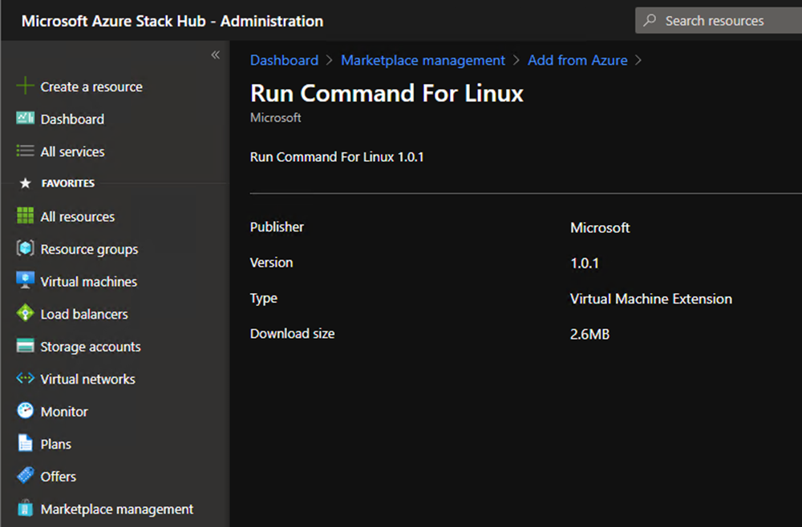
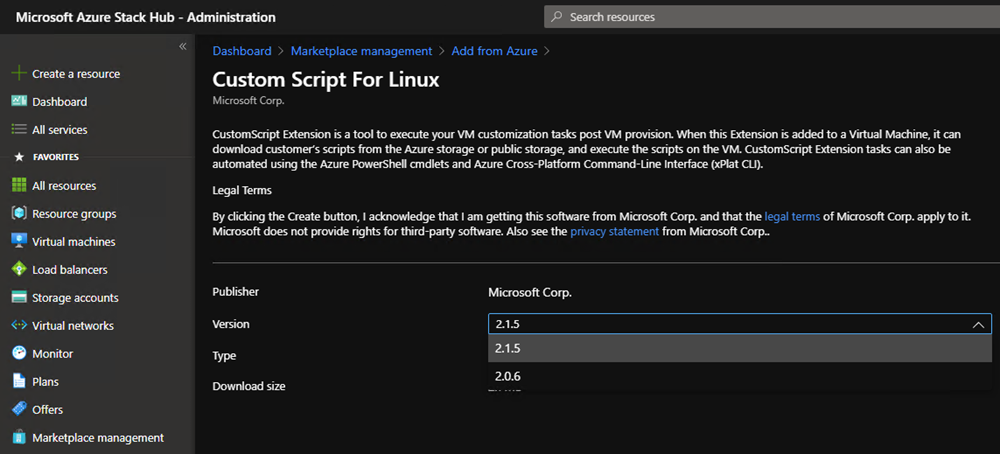
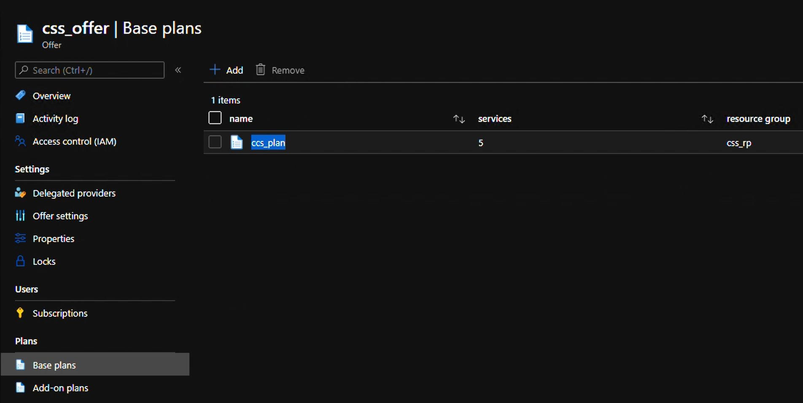
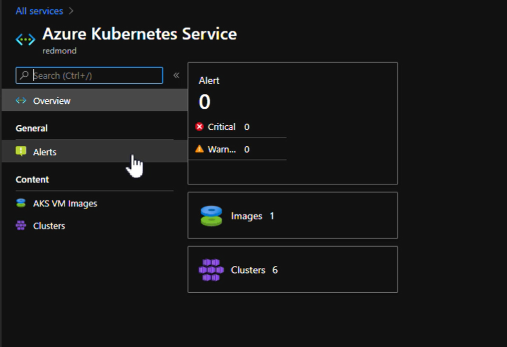

# Install and offer the Azure Kubernetes Service on Azure Stack Hub

Azure Kubernetes Service (AKS) enables your users to deploy Kubernetes clusters in Azure Stack Hub. AKS reduces the complexity and operational overhead of managing Kubernetes clusters. As a hosted Kubernetes service, Azure Stack Hub handles critical tasks like health monitoring and facilitates maintenance of clusters. The Azure Stack team manages the image used for maintaining the clusters. The cluster tenant administrator will only need to apply the updates as needed. The services come at no extra cost. AKSis free: you only pay to use the virtual machines (VM)s (master and agent nodes) within your clusters. You can install the Azure Kubernetes Service (AKS) resource provider for the users of your Azure Stack Hub. 

> [!IMPORTANT]
> Azure Kubernetes Service on Azure Stack Hub is currently in PREVIEW.
> See the [Supplemental Terms of Use for Microsoft Azure Previews](https://azure.microsoft.com/support/legal/preview-supplemental-terms/) for legal terms that apply to Azure features that are in beta, preview, or otherwise not yet released into general availability.

## Download required VM extensions

Make sure that the following VM extensions are available in your Azure Stack Hub. 

### Get the extensions from the portal

You can find them in the Azure Stack Hub Marketplace. You can download them from Azure if you need to add them to a disconnected environment. You can follow these instructions in [Download Marketplace items to Azure Stack Hub (Disconnected)](azure-stack-download-azure-marketplace-item.md?&tabs=az1%2Caz2&pivots=state-disconnected):

-   Run Command for Linux (latest version)

    

-   Custom Script for Linux (latest version)

    

### Get the extensions with PowerShell

PowerShell provides a cmdlet, `Get-AzsVMExtension`, to view which VM extensions available in your system. Run the following script to view the available extensions. Specify the correct URL for your Azure Stack Hub Resource Manager endpoint.

```powershell  
Add-AzureRMEnvironment -Name "AzureStackAdmin" -ArmEndpoint "https://adminmanagement.\<location\>.\<yourdomainname\>/"
Login-AzureRMAccount -EnvironmentName "AzureStackAdmin"
Get-AzsVMExtension
```

For information about installing and using the AzureStack PowerShell module, see [Install PowerShell Az module for Azure Stack Hub](powershell-install-az-module.md).

## Download AKS base image

The AKS Service needs a special VM image referred to the "AKS base Image". The AKS service will not work without the correct image version available in the local Azure Stack Hub marketplace. The image is meant to be used by the AKS service, not to be used by tenants to create individual VMs. The image will not be visible to tenants in the Marketplace. This is a task that needs to be done alongside every Azure Stack Hub Update. Every time there is a new update there will be a new AKS base image associated with the AKS Service. Here are the steps:

1.  Using the administrator portal, go the Marketplace management blade and select "Add from Azure", type "AKS" in the search box, locate, and download Linux "AKS Base Ubuntu Image version 2021.xx.xx" and Windows AKS base image select version `"xxxx.xxxx.xxxxxx" \ <update version and image>`

    

1.  If your instance is disconnected, follow the instructions in the article "[Download Marketplace items to Azure Stack Hub](/azure-stack/operator/azure-stack-download-azure-marketplace-item)" to download the two items mentioned from the marketplace in Azure and upload them to your Azure Stack Hub instance.

## Create plans and offers

To allow tenant users to use the AKS Service the operator needs to make it available through a plan and an offer.

1.  creates a plan with the `Microsoft.Container` service. There are no specific quotas for this service, it uses the quotas available for the Compute, Network, and Storage services:

    

2.  Again use the Azure Stack Hub administration portal to create an offer that contains the plan created in the prior step:

    

## Monitor and act on alerts

1.  Using the Admin Portal you can access the **Azure Kubernetes Service** under the **Administration** group.
2.  Select the "**Alerts**" blade. Review the alerts:

    

1.  Alerts will show in the **Alerts** blade, you will be able to take action on them if need to:


## Next steps

[Learn more about the AKS on Azure Stack Hub](../user/aks-overview.md)