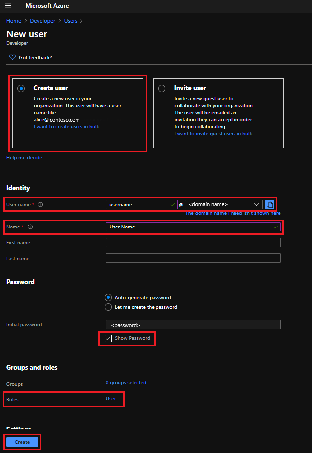

# Add a new Azure Stack Hub user account in Microsoft Entra ID

Before you can test offers and plans and create resources, you'll need a user account for the Azure Stack Hub user portal. You create a user account in your Microsoft Entra tenant, by using the Azure portal or PowerShell.

## Create user account using the Azure portal

You must have an Azure subscription to use the Azure portal.

1. Sign in to the [Azure portal](https://portal.azure.com).
1. Using the **Directory + Subscription** filter icon in the upper right, switch to the Microsoft Entra directory tenant you're using for Azure Stack Hub.
1. Using the search bar at the top, search for and select the **Microsoft Entra ID** service.
1. In the left pane, select **Users**.
1. On the **Users** page, select **+ New user**.

    [](media/azure-stack-add-new-user-aad/new-user-all-users.png#lightbox)

1. On the **New user** page, select **Create user** then fill in the required info:

    [](media/azure-stack-add-new-user-aad/new-user-user.png#lightbox)

   - **User name (required)**: The identifier used for sign in. For example, `mary@contoso.com`. The domain part of the user name must use either the initial default domain name, `<yourdomainname>`.`onmicrosoft.com`, or a custom domain name, such as `contoso.com`. For more information about how to create a custom domain name, see [How to add a custom domain name to Microsoft Entra ID](/azure/active-directory/fundamentals/add-custom-domain).
   - **Name (required)**: The first and last name of the new user. For example, `Mary Parker`.
   - **Show Password**: Select the checkbox and copy the autogenerated password provided in **Initial password**. You'll need this password for the initial sign-in process.
   - **Groups and roles**: Make sure the **User** directory role is selected.
   - **Settings** and **Job info**: Optionally, you can add more info about the user. You can also add user info later. For more details, see [How to add or change user profile information](/azure/active-directory/fundamentals/active-directory-users-profile-azure-portal).

1. Select **Create**. You should see a "Successfully created user" notification in the upper right.
1. Sign out and sign in to the Azure portal again, with the new account using the password you saved. Change the password when prompted.
1. [Sign in to the Azure Stack Hub user portal](../user/azure-stack-use-portal.md#access-the-portal) with the new account to see the user portal.

## Create a user account using PowerShell

If you don't have an Azure subscription, you can't use the Azure portal to add a tenant user account. In this case, you can use the Microsoft Graph module for Windows PowerShell instead.

1. Install the Microsoft Graph PowerShell SDK for Windows PowerShell with these steps:

   - Open an elevated Windows PowerShell command prompt (run Windows PowerShell as admin).
   - Run the **Install-Module Microsoft.Graph** command.
   - If you're prompted to install the NuGet provider, select **Y** and **Enter**.
   - If you're prompted to install the module from PSGallery, select **Y** and **Enter**.

1. Run the following cmdlet to connect.

   ```powershell
   Connect-MgGraph -Scopes 'User.ReadWrite.All'
   ```

1. After you connect, complete the sequence by adding the new user:

   ```powershell
   # Create the new user account (be sure to replace all <placeholder> values first)
   $PasswordProfile = @{ Password = '<password>' }
   New-MgUser -DisplayName "<UserName>" -PasswordProfile $passwordProfile -UserPrincipalName "<username>@<yourdomainname>" -MailNickName "<MailNickName>" -AccountEnabled 
   ```

1. Sign in to the [Azure portal](https://portal.azure.com) with the new user account. Change the password when prompted.
1. [Sign in to the Azure Stack Hub user portal](../user/azure-stack-use-portal.md#access-the-portal) with the new account to see the user portal.

## Next steps

- Learn how to create and test a subscription by [subscribing to an offer](../user/azure-stack-subscribe-services.md)
- [Add Azure Stack Hub users in AD FS](azure-stack-add-users-adfs.md)
