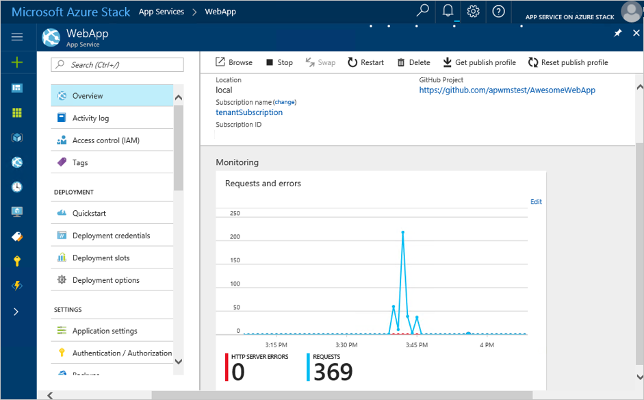

# Azure App Service and Azure Functions on Azure Stack Hub overview

Azure App Service on Azure Stack Hub is a platform-as-a-service (PaaS) offering from Microsoft Azure available on Azure Stack Hub. The service enables your internal or external customers to create Web and Azure Functions apps for any platform or device. They can integrate your apps with on-premises apps and automate their business processes. Azure Stack Hub cloud operators can run customer apps on fully managed virtual machines (VMs) with their choice of shared VM resources or dedicated VMs.

Azure App Service enables you to automate business processes and host cloud APIs. As a single integrated service, Azure App Service lets you combine various components (like websites, REST APIs, and business processes) into a single solution.

## Why offer Azure App Service on Azure Stack Hub?

Here are some key features and capabilities of Azure App Service:

- **Multiple languages and frameworks**: Azure App Service has first-class support for ASP.NET, Node.js, Java, PHP, and Python. You can also run Windows PowerShell and other scripts or executables on App Service VMs.
- **DevOps optimization**: Set up continuous integration and deployment with GitHub, local Git, or BitBucket. Promote updates through test and staging environments, and manage your apps in App Service by using Azure PowerShell or the cross-platform command-line interface (Azure CLI).
- **Visual Studio integration**: Dedicated tools in Visual Studio streamline the work of creating and deploying apps.

## App types in App Service

App Service offers several app types, each of which is intended to host a specific workload:

- [Web Apps](/azure/app-service/overview) for hosting websites, web apps and REST APIs.
- [Azure Functions v1](/azure/azure-functions/functions-versions) for hosting event driven, serverless workloads.

The word *app* refers to the hosting resources dedicated to running a workload. Taking *web app* as an example, you're probably accustomed to thinking of a web app as both the compute resources and app code that together deliver functionality to a browser. In Azure App Service, a web app is the compute resource that Azure Stack Hub provides for hosting your app code.

Your app can be composed of multiple App Service apps of different kinds. For example, if your app is composed of a web front end and a REST API back end, you can:

- Deploy both (front end and API) to a single web app.
- Deploy your front-end code to a web app and your back-end code to an API app.

   

## What is an App Service plan?

The App Service resource provider uses the same code that Azure App Service uses, and thus shares some common concepts. In App Service, the pricing container for apps is called the *App Service plan*. It represents the set of dedicated VMs used to hold your apps. Within a given subscription, you can have multiple App Service plans.

In Azure, there are shared and dedicated workers. A shared worker supports high-density and multi-tenant app hosting, and there's only one set of shared workers. Dedicated servers are used by only one tenant and come in three sizes: small, medium, and large. The needs of on-premises customers can't always be described by using those terms. In App Service on Azure Stack Hub, resource provider admins define the worker tiers they want to make available. Based on your unique hosting needs, you can define multiple sets of shared workers or different sets of dedicated workers. By using those worker-tier definitions, they can then define their own pricing SKUs.

## Portal features

Azure App Service on Azure Stack Hub uses the same user interface that Azure App Service uses. The same is true with the back end. However, some features are disabled in Azure Stack Hub. The Azure-specific expectations or services that those features require aren't currently available in Azure Stack Hub.

## Next steps

- [Prerequisites for deploying App Service on Azure Stack Hub](azure-stack-app-service-before-you-get-started.md)
- [Install the Azure App Service resource provider](azure-stack-app-service-deploy.md)

You can also try out other [platform as a service (PaaS) services](service-plan-offer-subscription-overview.md), such as the [SQL Server resource provider](azure-stack-sql-resource-provider-deploy.md) and the [MySQL resource provider](azure-stack-mysql-resource-provider-deploy.md).
