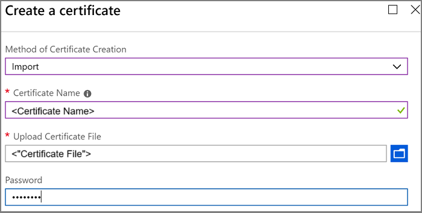

# Infrastructure Backup Service best practices

Follow these best practices when you deploy and manage Azure Stack Hub to help mitigate data loss if there's a catastrophic failure.

Review the best practices regularly to verify that your installation is still in compliance when changes are made to the operation flow. If you come across any issues while implementing these best practices, contact Microsoft Support for help.

## Configuration best practices

### Deployment

Enable Infrastructure Backup after deployment of each Azure Stack Hub Cloud. Using Azure Stack Hub PowerShell, you can schedule backups from any client/server with access to the operator management API endpoint.

### Networking

The Universal Naming Convention (UNC) string for the path must use a fully qualified domain name (FQDN). IP address can be used if name resolution isn't possible. A UNC string specifies the location of resources such as shared files or devices.

### Encryption

#### Version 1901 and newer

The encryption certificate is used to encrypt backup data that gets exported to external storage. The certificate can be a self-signed certificate since the certificate is only used to transport keys. Refer to New-SelfSignedCertificate for more info on how to create a certificate.
  
The key must be stored in a secure location (for example, global Azure Key Vault certificate). The CER format of the certificate is used to encrypt data. The PFX format must be used during cloud recovery deployment of Azure Stack Hub to decrypt backup data.

#### 1811 and older

The encryption key is used to encrypt backup data that gets exported to external storage. The key is generated as part of [enabling backup for Azure Stack Hub with PowerShell](azure-stack-backup-enable-backup-powershell.md).

The key must be stored in a secure location (for example, global Azure Key Vault secret). This key must be used during redeployment of Azure Stack Hub.

## Operational best practices

### Backups

 - Backup jobs execute while the system is running so there's no downtime to the management experiences or user apps. Expect the backup jobs to take 20-40 minutes for a solution that's under reasonable load.
 - Automatic backups will not start during patch and update and FRU operations. Scheduled backups jobs will get skipped by default. On-demand requests for backups are blocked as well during these operations.    
 - Using OEM provided instructions, manually backed up network switches and the hardware lifecycle host (HLH) should be stored on the same backup share where the Infrastructure Backup Controller stores control plane backup data. Consider storing switch and HLH configurations in the region folder. If you have multiple Azure Stack Hub instances in the same region, consider using an identifier for each configuration that belongs to a scale unit.

### Folder Names

 - Infrastructure creates MASBACKUP folder automatically. This is a Microsoft-managed share. You can create shares at the same level as MASBACKUP. It's not recommended to create folders or storage data inside of MASBACKUP that Azure Stack Hub doesn't create.
 -  User FQDN and region in your folder name to differentiate backup data from different clouds. The FQDN of your Azure Stack Hub deployment and endpoints is the combination of the Region parameter and the External Domain Name parameter. For more info, see [Azure Stack Hub datacenter integration - DNS](azure-stack-integrate-dns.md).

For example, the backup share is AzSBackups hosted on fileserver01.contoso.com. In that file share there may be a folder per Azure Stack Hub deployment using the external domain name and a subfolder that uses the region name.

FQDN: contoso.com  
Region: nyc

    \\fileserver01.contoso.com\AzSBackups
    \\fileserver01.contoso.com\AzSBackups\contoso.com
    \\fileserver01.contoso.com\AzSBackups\contoso.com\nyc
    \\fileserver01.contoso.com\AzSBackups\contoso.com\nyc\MASBackup

MASBackup folder is where Azure Stack Hub stores its backup data. Don't use this folder to store your own data. OEMs shouldn't use this folder to store any backup data either.

OEMs are encouraged to store backup data for their components under the region folder. Each network switch, hardware lifecycle host (HLH), and so on, may be stored in its own subfolder. For example:

    \\fileserver01.contoso.com\AzSBackups\contoso.com\nyc\HLH
    \\fileserver01.contoso.com\AzSBackups\contoso.com\nyc\Switches
    \\fileserver01.contoso.com\AzSBackups\contoso.com\nyc\DeploymentData
    \\fileserver01.contoso.com\AzSBackups\contoso.com\nyc\Registration

### Monitoring

The following alerts are supported by the system:

| Alert                                                   | Description                                                                                     | Remediation                                                                                                                                |
|---------------------------------------------------------|-------------------------------------------------------------------------------------------------|--------------------------------------------------------------------------------------------------------------------------------------------|
| Backup failed because the file share is out of capacity. | File share is out of capacity and backup controller can't export backup files to the location. | Add more storage capacity and try back up again. Delete existing backups (starting from oldest first) to free up space.                    |
| Backup failed due to connectivity problems.             | Network between Azure Stack Hub and the file share is experiencing issues.                          | Address the network issue and try backup again.                                                                                            |
| Backup failed due to a fault in the path.                | The file share path can't be resolved.                                                          | Map the share from a different computer to ensure the share is accessible. You may need to update the path if it's no longer valid.       |
| Backup failed due to authentication issue.               | There might be an issue with the credentials or a network issue that impacts authentication.    | Map the share from a different computer to ensure the share is accessible. You may need to update credentials if they're no longer valid. |
| Backup failed due to a general fault.                    | The failed request could be due to an intermittent issue. Try to back up again.                    | Call support.                                                                                                                               |

## Next steps

Review the reference material for the [Infrastructure Backup Service](azure-stack-backup-reference.md).

Enable the [Infrastructure Backup Service](azure-stack-backup-enable-backup-console.md).
