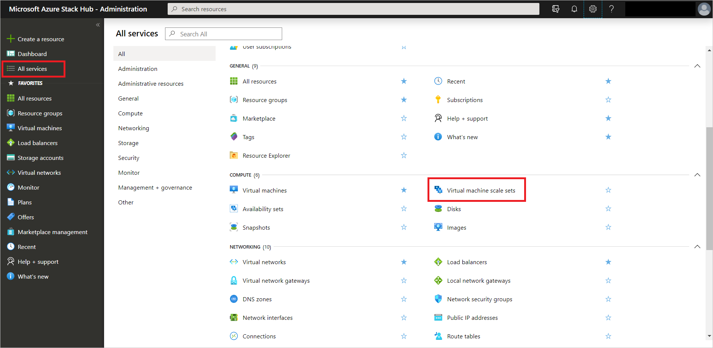
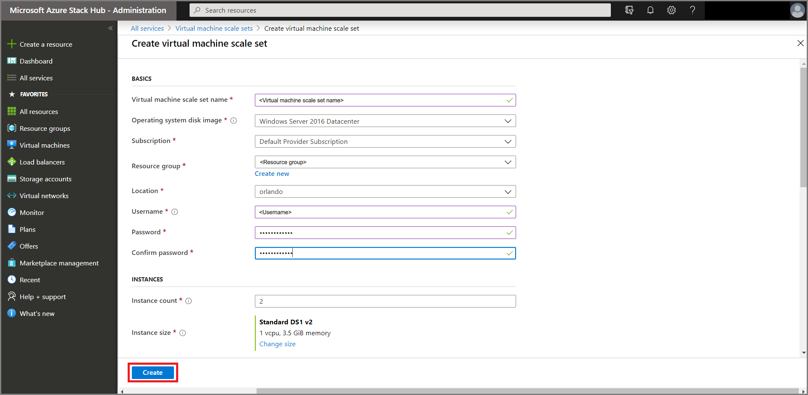
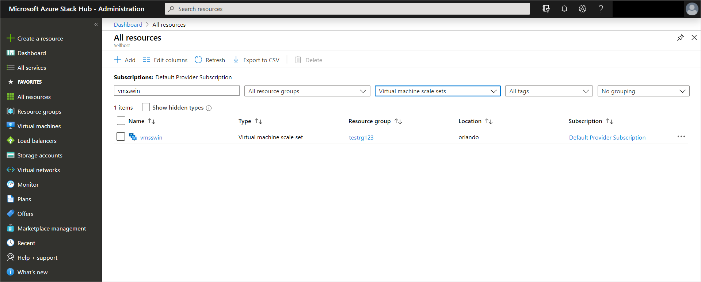
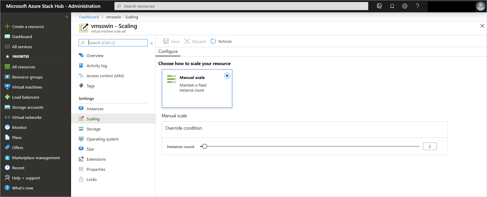

# Make virtual machine scale sets available in Azure Stack Hub

Virtual machine scale sets are an Azure Stack Hub compute resource. You can use scale sets to deploy and manage a set of identical virtual machines (VMs). With all VMs configured in the same way, scale sets do not require pre-provisioning of VMs. It's easier to build large-scale services that target big compute, big data, and containerized workloads.

This article guides you through the process of making scale sets available in the Azure Stack Hub Marketplace. After you complete this procedure, your users can add virtual machine scale sets to their subscriptions.

Virtual machine scale sets on Azure Stack Hub are similar to virtual machine scale sets on Azure. For more information, see the following videos:

* [Mark Russinovich talks Azure scale sets](https://channel9.msdn.com/Blogs/Regular-IT-Guy/Mark-Russinovich-Talks-Azure-Scale-Sets/)
* [Virtual machine scale sets with Guy Bowerman](https://channel9.msdn.com/Shows/Cloud+Cover/Episode-191-Virtual-Machine-Scale-Sets-with-Guy-Bowerman)

On Azure Stack Hub, virtual machine scale sets do not support autoscale. You can add more instances to a scale set using Resource Manager templates, CLI, or PowerShell.

## Prerequisites

* **Azure Stack Hub Marketplace:** Register Azure Stack Hub with global Azure to enable the availability of items in the Azure Stack Hub Marketplace. Follow the instructions in [Register Azure Stack Hub with Azure](azure-stack-registration.md).
* **Operating system image:** Before a virtual machine scale set can be created, you must download the VM images for use in the scale set from the [Azure Stack Hub Marketplace](azure-stack-download-azure-marketplace-item.md). The images must already be present before a user can create a new scale set.

## Use the Azure Stack Hub portal

1. Sign in to the Azure Stack Hub portal. Then, go to **All services**, then **Virtual machine scale sets**, and then under **COMPUTE**, select **Virtual machine scale sets**.
   

2. Select ***Create Virtual machine scale sets***.
   

3. Fill in the empty fields, choose from the dropdowns for **Operating system disk image**, **Subscription**, and **Instance size**. Select **Yes** for **Use managed disks**. Then, click **Create**.
    

4. To see your new virtual machine scale set, go to **All resources**, search for the virtual machine scale set name, and then select its name in the search.
   

## Update images in a virtual machine scale set

After you create a virtual machine scale set, users can update images in the scale set without the scale set having to be recreated. The process to update an image depends on the following scenarios:

1. Virtual machine scale set deployment template specifies **latest** for **version**:  

   When the `version` is set to **latest** in the `imageReference` section of the template for a scale set, scale-up operations on the scale set use the newest available version of the image for the scale set instances. After a scale-up is complete, you can delete older virtual machine scale sets instances. The values for `publisher`, `offer`, and `sku` remain unchanged.

   The following JSON example specifies `latest`:  

    ```json  
    "imageReference": {
        "publisher": "[parameters('osImagePublisher')]",
        "offer": "[parameters('osImageOffer')]",
        "sku": "[parameters('osImageSku')]",
        "version": "latest"
        }
    ```

2. Virtual machine scale set deployment template **does not specify latest** for **version** and specifies a version number instead:  

    If the Azure Stack operator downloads an image with a newer version (and deletes the older version), the scale set cannot scale up. This is by design, as the image version specified in the scale set template must be available.  

For more information, see [operating system disks and images](../user/azure-stack-compute-overview.md#operating-system-disks-and-images).  

## Scale a virtual machine scale set

You can change the size of a virtual machine scale set to make it larger or smaller.

1. In the portal, select your scale set and then select **Scaling**.

2. Use the slide bar to set the new level of scaling for this virtual machine scale set, and then click **Save**.

     

## Next steps

* [Download marketplace items from Azure to Azure Stack Hub](azure-stack-download-azure-marketplace-item.md)
