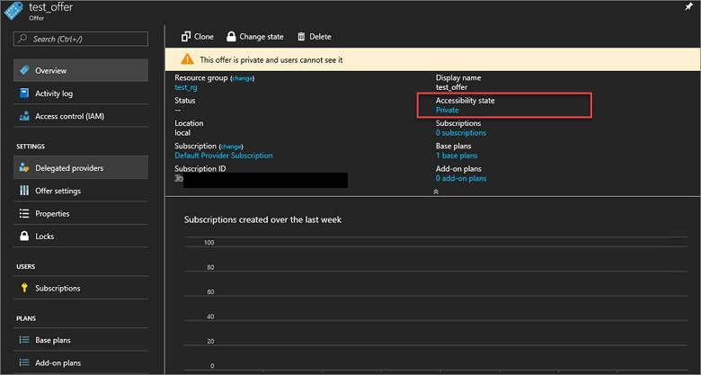
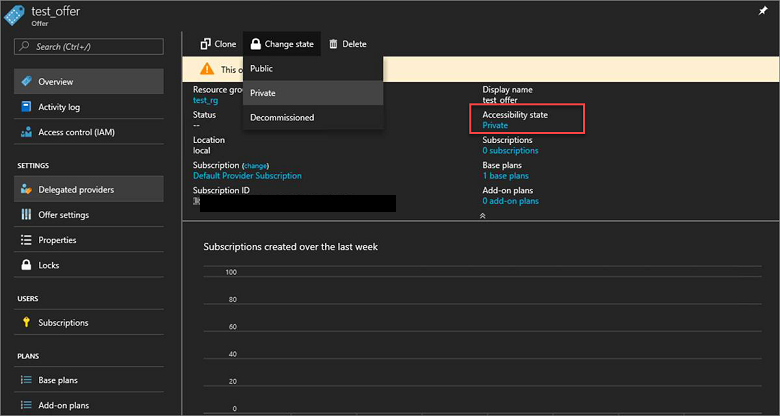

# Create an offer in Azure Stack Hub

[Offers](azure-stack-overview.md) are groups of one or more plans that providers present to users, which those users can buy or subscribe to. This article describes how to create an offer that includes the [plan that you created](azure-stack-create-plan.md). This offer gives subscribers the ability to set up virtual machines (VMs).

::: moniker range=">=azs-1902"
## Create an offer (1902 and later)

1. Sign in to the Azure Stack Hub administrator portal `https://adminportal.local.azurestack.external` and select **+ Create a resource**, then **Offers + Plans**, and then **Offer**.

   

2. A tabbed user interface appears that enables you to define the offer name. You can also add existing or create new base plans and add-on plans. Most importantly, you can review the details of the offer you create before you decide to create it.

   In the **Basics** tab, enter a **Display Name** and a **Resource Name**, and then under **Resource Group**, select **Create new** or **Use existing**. The display name is the friendly name for the offer. This friendly name is the only information about the offer that users see when they subscribe to an offer in the user portal. Use an intuitive name that helps users understand what comes with the offer. Only the admin can see the resource name. It's the name that admins use to work with the offer as an Azure Resource Manager resource. In this tab, you can also choose to make this offer public or keep it private. The default setting is private. You can [change the public or private state of the offer](#change-the-state-of-an-offer) at any time.

   
  
3. Select the **Base plans** tab or click the **Next : Base plans >** button. Select the plan(s) you want to include in the offer.

   

4. At this point you can create an add-on plan to modify the base plan, but this is optional. You have the opportunity to create an add-on plan in the next article, [Azure Stack Hub add-on plans](create-add-on-plan.md).

5. Select the **Review + create** tab. Review the offer summary to ensure that all values are correct. The interface enables you to expand the quotas in the chosen plans one at a time to view the details of each quota in a plan. You can also go back to make any necessary edits.

6. Select **Create** to create the offer.

   

### Change the state of an offer

After creating the offer, you can change its state. Offers must be made **Public** for users to get the full view when they subscribe. Offers can be:

- **Public**: Visible to users.
- **Private**: Only visible to cloud administrators. This setting is useful while drafting the plan or offer, or if the cloud administrator wants to [create each subscription for users](azure-stack-subscribe-plan-provision-vm.md#create-a-subscription-as-a-cloud-operator).
- **Decommissioned**: Closed to new subscribers. The cloud administrator can decommission offers to prevent future subscriptions, but leave current subscribers unaffected.

  > [!TIP]  
  > Changes to the offer aren't immediately visible to the user. To see the changes, users might have to sign out and sign in again to the user portal to see the new offer.

There are two ways to change the state of an offer:

1. In **All resources**, select the name of the offer. On the **Overview** screen for the offer, select **Change state**. Choose the state you want to use (for example, **Public**).

   

2. Select **Offer settings**. Choose the state you want to use (for example, **Public**), then select **Save**.

   
::: moniker-end

::: moniker range="<=azs-1901"
## Create an offer (1901 and earlier)

1. Sign in to the Azure Stack Hub administrator portal `https://adminportal.local.azurestack.external` and select **+ Create a resource**, then **Tenant Offers + Plans**, and then **Offer**.

   
  
2. Under **New Offer**, enter a **Display Name** and a **Resource Name**, and then under **Resource Group**, select **Create new** or **Use existing**. The display name is the friendly name for the offer. This friendly name is the only information about the offer that users see when they subscribe to an offer. Use an intuitive name that helps users understand what comes with the offer. Only the admin can see the resource name. It's the name that admins use to work with the offer as an Azure Resource Manager resource.

   
  
3. Select **Base plans** to open the **Plan**. Select the plans you want to include in the offer, and then choose **Select**. To create the offer, select **Create**.

   
  
4. After creating the offer, you can change its state. Offers must be made **Public** for users to get the full view when they subscribe. Offers can be:

   - **Public**: Visible to users.
   - **Private**: Only visible to cloud administrators. This setting is useful while drafting the plan or offer, or if the cloud administrator wants to [create each subscription for users](azure-stack-subscribe-plan-provision-vm.md#create-a-subscription-as-a-cloud-operator).
   - **Decommissioned**: Closed to new subscribers. The cloud administrator can decommission offers to prevent future subscriptions, but leave current subscribers unaffected.

   > [!TIP]  
   > Changes to the offer aren't immediately visible to the user. To see the changes, users might have to sign out and sign in again to the user portal to see the new offer.

   On the overview screen for the offer, select **Accessibility state**. Choose the state you want to use (for example, **Public**), and then select **Save**.

     

     As an alternative, select **Change state** and then choose a state.

    

> [!NOTE]
> You can also use PowerShell to create default offers, plans, and quotas. For more information, see [Azure Stack Hub PowerShell Module 1.4.0](/azure-stack/operator).
::: moniker-end

## Next steps

- To learn how to modify an offer and provide your users with an add-on plan, continue with [Create an add-on plan](create-add-on-plan.md) (optional)
- Otherwise, jump to [Subscribe to an offer](azure-stack-subscribe-plan-provision-vm.md)
