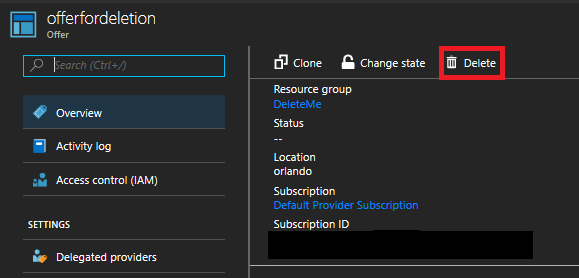

# Delete quotas, plans, offers, and subscriptions

This article describes how to delete quotas, plans, offers, and subscriptions that you no longer need. As a general principle, you can delete only what is not in use. For example, deleting an offer is only possible if there are no subscriptions that belong to that offer.

Subscriptions are the exception to this general principle: you can delete subscriptions that contain resources; and the resources will be deleted along with the subscription.

Therefore, if you want to delete a quota, you must work back through any plans and offers that use that quota: starting with the offers, ensure they have no subscriptions, delete each offer, then delete the plans that use the quota, and so on.

## Delete a subscription

To delete a subscription, select **All services**, then **User subscriptions**, to display a list of all subscriptions on the system. If you are working on an offer, you can also select **Subscriptions** from there.

You can delete subscriptions from this list, or you can use PowerShell to write a script that deletes all subscriptions for you, using the commands documented in the [Subscriptions - Delete reference](/rest/api/azurestack/subscriptions/delete).

> [!CAUTION]
> Deleting a subscription also deletes any data and resources it contains.

## Delete an offer

To delete an offer, in the administrator portal, go to **All services**, then **Offers**. Select the offer you want to delete, then select **Delete**.

You can only delete an offer when there are no subscriptions using it. If subscriptions exist based on the offer, the **Delete** option is not available. In this case, see the [Delete a subscription](#delete-a-subscription) section.

## Delete a plan

To delete a plan, in the administrator portal go to **All services**, then **Plans**. Select the plan you want to delete, then select **Delete**.

You can only delete a plan when there are no offers or subscriptions using it. If there are offers that use the plan, delete the plan, allow it to fail, and you will receive an error message. You can select **Parent offers** to display a list of offers that use the plan. For more information about deleting offers, see [Delete an offer](#delete-an-offer).

Plans might have been added directly to a subscription as add-on plans, even if they are not part of the offer. In this case, they must be removed from the subscriptions that use them before the plan can be deleted.

Also, a plan cannot be removed from a subscription if it is the only source of a given resource for that subscription. For example, if Plan A has been added to Subscription 1, and it is the only plan providing a network quota to the subscription, it cannot be removed from the subscription. Therefore, it cannot be deleted.

## Edit and delete a quota

You can view and edit existing quotas using the administrator portal: select **Region Management**, then select the relevant resource provider, and click on **Quotas**. You can also delete quotas for certain resource providers.

Alternatively, you can delete some quotas using these REST APIs:

- [Compute](/rest/api/azurestack/quotas%20(compute)/delete)
- [Network](/rest/api/azurestack/quotas%20(network)/delete)

> [!NOTE]
> You cannot delete a quota if there are any current plans that use it. You must first delete the plan that references the quota.

## Next steps

- [Create subscriptions](azure-stack-subscribe-plan-provision-vm.md)
- [Provision a virtual machine](../user/azure-stack-create-vm-template.md)