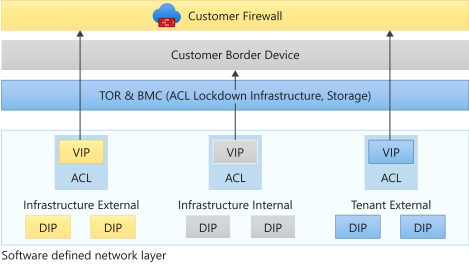

# Publish Azure Stack Hub services in your datacenter

Azure Stack Hub sets up virtual IP addresses (VIPs) for its infrastructure roles. These VIPs are allocated from the public IP address pool. Each VIP is secured with an access control list (ACL) in the software-defined network layer. ACLs are also used across the physical switches (TORs and BMC) to further harden the solution. A DNS entry is created for each endpoint in the external DNS zone that's specified at deployment time. For example, the user portal is assigned the DNS host entry of portal.*&lt;region>.&lt;fqdn>*.

The following architectural diagram shows the different network layers and ACLs:

## Ports and URLs

To make Azure Stack Hub services (like the portals, Azure Resource Manager, DNS, and so on) available to external networks, you must allow inbound traffic to these endpoints for specific URLs, ports, and protocols.

In a deployment where a transparent proxy uplinks to a traditional proxy server or a firewall is protecting the solution, you must allow specific ports and URLs for both [inbound](azure-stack-integrate-endpoints.md#ports-and-protocols-inbound) and [outbound](azure-stack-integrate-endpoints.md#ports-and-urls-outbound) communication. These include ports and URLs for identity, the marketplace, patch and update, registration, and usage data.

SSL traffic interception is [not supported](azure-stack-firewall.md#ssl-interception) and can lead to service failures when accessing endpoints. 

## Ports and protocols (inbound)

A set of infrastructure VIPs is required for publishing Azure Stack Hub endpoints to external networks. The *Endpoint (VIP)* table shows each endpoint, the required port, and protocol. Refer to the specific resource provider deployment documentation for endpoints that require additional resource providers, like the SQL resource provider.

Internal infrastructure VIPs aren't listed because they're not required for publishing Azure Stack Hub. User VIPs are dynamic and defined by the users themselves, with no control by the Azure Stack Hub operator.

> [!Note]  
> IKEv2 VPN is a standards-based IPsec VPN solution that uses UDP port 500 and 4500 and TCP port 50. Firewalls don't always open these ports, so an IKEv2 VPN might not be able to traverse proxies and firewalls.

With the addition of the [Extension Host](azure-stack-extension-host-prepare.md), ports in the range of 12495-30015 aren't required.

|Endpoint (VIP)|DNS host A record|Protocol|Ports|
|---------|---------|---------|---------|
|AD FS|Adfs.*&lt;region>.&lt;fqdn>*|HTTPS|443|
|Portal (administrator)|Adminportal.*&lt;region>.&lt;fqdn>*|HTTPS|443|
|Adminhosting | *.adminhosting.\<region>.\<fqdn> | HTTPS | 443 |
|Azure Resource Manager (administrator)|Adminmanagement.*&lt;region>.&lt;fqdn>*|HTTPS|443|
|Portal (user)|Portal.*&lt;region>.&lt;fqdn>*|HTTPS|443|
|Azure Resource Manager (user)|Management.*&lt;region>.&lt;fqdn>*|HTTPS|443|
|Graph|Graph.*&lt;region>.&lt;fqdn>*|HTTPS|443|
|Certificate revocation list|Crl.*&lt;region>.&lt;fqdn>*|HTTP|80|
|DNS|&#42;.*&lt;region>.&lt;fqdn>*|TCP & UDP|53|
|Hosting | *.hosting.\<region>.\<fqdn> | HTTPS | 443 |
|Key Vault (user)|&#42;.vault.*&lt;region>.&lt;fqdn>*|HTTPS|443|
|Key Vault (administrator)|&#42;.adminvault.*&lt;region>.&lt;fqdn>*|HTTPS|443|
|Storage Queue|&#42;.queue.*&lt;region>.&lt;fqdn>*|HTTP HTTPS|80 443|
|Storage Table|&#42;.table.*&lt;region>.&lt;fqdn>*|HTTP HTTPS|80 443|
|Storage Blob|&#42;.blob.*&lt;region>.&lt;fqdn>*|HTTP HTTPS|80 443|
|SQL Resource Provider|sqladapter.dbadapter.*&lt;region>.&lt;fqdn>*|HTTPS|44300-44304|
|MySQL Resource Provider|mysqladapter.dbadapter.*&lt;region>.&lt;fqdn>*|HTTPS|44300-44304|
|App Service|&#42;.appservice.*&lt;region>.&lt;fqdn>*|TCP|80 (HTTP) 443 (HTTPS) 8172 (MSDeploy)|
|  |&#42;.scm.appservice.*&lt;region>.&lt;fqdn>*|TCP|443 (HTTPS)|
|  |api.appservice.*&lt;region>.&lt;fqdn>*|TCP|443 (HTTPS) 44300 (Azure Resource Manager)|
|  |ftp.appservice.*&lt;region>.&lt;fqdn>*|TCP, UDP|21, 1021, 10001-10100 (FTP) 990 (FTPS)|
|VPN Gateways|     |     |[See the VPN gateway FAQ](/azure/vpn-gateway/vpn-gateway-vpn-faq#can-i-traverse-proxies-and-firewalls-using-point-to-site-capability).|
|     |     |     |     |

## Ports and URLs (outbound)

Azure Stack Hub supports only transparent proxy servers. In a deployment with a transparent proxy uplink to a traditional proxy server, you must allow the ports and URLs in the following table for outbound communication.

SSL traffic interception is [not supported](azure-stack-firewall.md#ssl-interception) and can lead to service failures when accessing endpoints. The maximum supported timeout to communicate with endpoints required for identity is 60s.

> [!Note]  
> Azure Stack Hub doesn't support using ExpressRoute to reach the Azure services listed in the following table because ExpressRoute may not be able to route traffic to all of the endpoints.

|Purpose|Destination URL|Protocol|Ports|Source Network|
|---------|---------|---------|---------|---------|
|Identity|**Azure** login.windows.net login.microsoftonline.com graph.windows.net https:\//secure.aadcdn.microsoftonline-p.com www.office.com ManagementServiceUri = https:\//management.core.windows.net ARMUri = https:\//management.azure.com https:\//\*.msftauth.net https:\//\*.msauth.net https:\//\*.msocdn.com **Azure Government** https:\//login.microsoftonline.us/ https:\//graph.windows.net/ **Azure China 21Vianet** https:\//login.chinacloudapi.cn/ https:\//graph.chinacloudapi.cn/ **Azure Germany** https:\//login.microsoftonline.de/ https:\//graph.cloudapi.de/|HTTP HTTPS|80 443|Public VIP - /27 Public infrastructure Network|
|Marketplace syndication|**Azure** https:\//management.azure.com https://&#42;.blob.core.windows.net https://&#42;.azureedge.net **Azure Government** https:\//management.usgovcloudapi.net/ https://&#42;.blob.core.usgovcloudapi.net/ **Azure China 21Vianet** https:\//management.chinacloudapi.cn/ http://&#42;.blob.core.chinacloudapi.cn|HTTPS|443|Public VIP - /27|
|Patch & Update|https://&#42;.azureedge.net https:\//aka.ms/azurestackautomaticupdate|HTTPS|443|Public VIP - /27|
|Registration|**Azure** https:\//management.azure.com **Azure Government** https:\//management.usgovcloudapi.net/ **Azure China 21Vianet** https:\//management.chinacloudapi.cn|HTTPS|443|Public VIP - /27|
|Usage|**Azure** https://&#42;.trafficmanager.net **Azure Government** https://&#42;.usgovtrafficmanager.net **Azure China 21Vianet** https://&#42;.trafficmanager.cn|HTTPS|443|Public VIP - /27|
|Windows Defender|&#42;.wdcp.microsoft.com &#42;.wdcpalt.microsoft.com &#42;.wd.microsoft.com &#42;.update.microsoft.com &#42;.download.microsoft.com  https:\//secure.aadcdn.microsoftonline-p.com |HTTPS|80 443|Public VIP - /27 Public infrastructure Network|
|NTP|(IP of NTP server provided for deployment)|UDP|123|Public VIP - /27|
|DNS|(IP of DNS server provided for deployment)|TCP UDP|53|Public VIP - /27|
|SYSLOG|(IP of SYSLOG server provided for deployment)|TCP UDP|6514 514|Public VIP - /27|
|CRL|(URL under CRL Distribution Points on your certificate) http://crl.microsoft.com/pki/crl/products http://mscrl.microsoft.com/pki/mscorp http://www.microsoft.com/pki/certs http://www.microsoft.com/pki/mscorp http://www.microsoft.com/pkiops/crl http://www.microsoft.com/pkiops/certs |HTTP|80|Public VIP - /27|
|LDAP|Active Directory Forest provided for Graph integration|TCP UDP|389|Public VIP - /27|
|LDAP SSL|Active Directory Forest provided for Graph integration|TCP|636|Public VIP - /27|
|LDAP GC|Active Directory Forest provided for Graph integration|TCP|3268|Public VIP - /27|
|LDAP GC SSL|Active Directory Forest provided for Graph integration|TCP|3269|Public VIP - /27|
|AD FS|AD FS metadata endpoint provided for AD FS integration|TCP|443|Public VIP - /27|
|Diagnostic Log collection service|Azure Storage provided Blob SAS URL|HTTPS|443|Public VIP - /27|
|     |     |     |     |     |

Outbound URLs are load balanced using Azure traffic manager to provide the best possible connectivity based on geographic location. With load balanced URLs, Microsoft can update and change backend endpoints without affecting customers. Microsoft doesn't share the list of IP addresses for the load balanced URLs. Use a device that supports filtering by URL rather than by IP.

Outbound DNS is required at all times; what varies is the source querying the external DNS and what type of identity integration was chosen. During deployment for a connected scenario, the DVM that sits on the BMC network needs outbound access. But after deployment, the DNS service moves to an internal component that will send queries through a Public VIP. At that time, the outbound DNS access through the BMC network can be removed, but the Public VIP access to that DNS server must remain or else authentication will fail.

## Next steps

[Azure Stack Hub PKI requirements](azure-stack-pki-certs.md)
