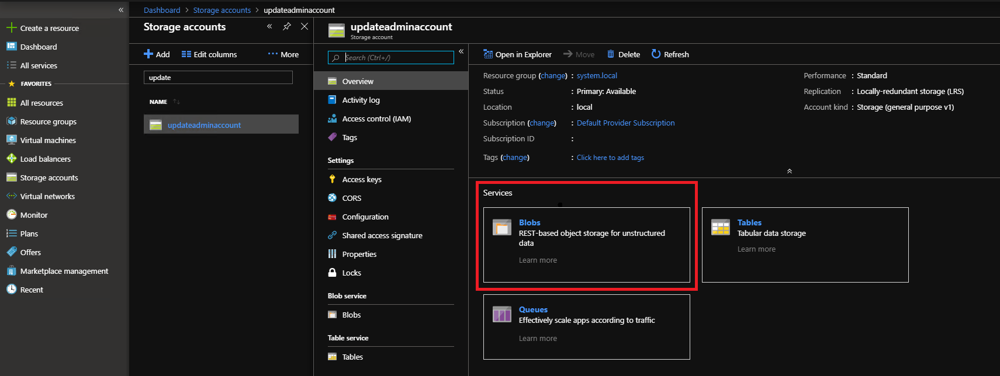

# Update Windows Defender Antivirus on Azure Stack Hub

[Windows Defender Antivirus](/windows/security/threat-protection/windows-defender-antivirus/windows-defender-antivirus-in-windows-10) is an antimalware solution that provides security and virus protection. Every Azure Stack Hub infrastructure component (Hyper-V hosts and virtual machines) is protected with Windows Defender Antivirus. For up-to-date protection, you need periodic updates to Windows Defender Antivirus definitions, engine, and platform. How updates are applied depends on your configuration.

## Connected scenario

The Azure Stack Hub [update resource provider](azure-stack-updates.md#the-update-resource-provider) downloads antimalware definitions and engine updates multiple times per day. Each Azure Stack Hub infrastructure component gets the update from the update resource provider and applies the update automatically.

For those Azure Stack Hub deployments that are connected to the public Internet, apply the [monthly Azure Stack Hub update](azure-stack-apply-updates.md). The monthly Azure Stack Hub update includes Windows Defender Antivirus platform updates for the month.

## Disconnected scenario

For those Azure Stack Hub deployments that are not connected to the public Internet (e.g. air-gapped datacenters), starting with the 1910 release, customers have the ability to apply the antimalware definitions and engine updates as they are published. 

To apply the updates to your Azure Stack Hub solution, you first have to download them from the Microsoft site (links below) and subsequently, import them into a storage blob container under your *updateadminaccount*. A scheduled task scans the blob container every 30 minutes and, if new Defender definitions and engine updates are found, it applies them to the Azure Stack Hub infrastructure. 

For those disconnected deployments that are not yet on 1910 or later, or that don't have the ability to download Defender definitions and engine updates on a daily basis, the monthly Azure Stack Hub update includes Windows Defender Antivirus definitions, engine, and platform updates for the month. 


### Set up Windows Defender for manual updates 

With the 1910 release, two new cmdlets were added to the privileged endpoint to configure Windows Defender manual update in Azure Stack Hub. 

```powershell 
### cmdlet to configure the storage blob container for the Defender updates 
Set-AzsDefenderManualUpdate [-Container <string>] [-Remove]  
### cmdlet to retrieve the configuration of the Defender manual update settings 
Get-AzsDefenderManualUpdate  
``` 

The following procedure shows how to setup Windows Defender manual update. 

1. Connect to the privileged endpoint and run the following cmdlet to specify the name of the storage blob container where the Defender updates will be uploaded. 

   > [!NOTE] 
   > The manual update process described below only works in disconnected environments where access to "go.microsoft.com" is not allowed. Trying to run the cmdlet Set-AzsDefenderManualUpdate in connected environments will result in an error. 

   ```powershell 
   ### Configure the storage blob container for the Defender updates 
   Set-AzsDefenderManualUpdate -Container <yourContainerName>
   ``` 

2. Download the two Windows Defender update packages and save them on a location that is reachable from your Azure Stack Hub administration portal.  

   * mpam-fe.exe from [https://go.microsoft.com/fwlink/?LinkId=121721&arch=x64](https://go.microsoft.com/fwlink/?LinkId=121721&arch=x64) 
   * nis_full.exe from [https://go.microsoft.com/fwlink/?LinkId=197094](https://go.microsoft.com/fwlink/?LinkId=197094) 

   > [!NOTE] 
   > You'll have to download these two files **every time** you want to update the Defender signatures. 

3. In the administration portal, select **All services**. Then, under the **DATA + STORAGE** category, select **Storage accounts**. (Or, in the filter box, start typing **storage accounts**, and select it.) 

     

4. In the filter box, type **update**, and select the **updateadminaccount** storage account. 

5. In the storage account details, under **Services**, select **Blobs**. 

    

6. Under **Blob service**, select **+ Container** to create a container. Enter the name that was specified with the Set-AzsDefenderManualUpdate (in this example *defenderupdates*) and then select **OK**. 

    

7. After the container is created, click the container name, and then click **Upload** to upload the package files to the container. 

    

8. Under **Upload blob**, click the folder icon, browse to the Windows Defender update *mpam-fe.exe* files and then click **Open** in the file explorer window. 

9. Under **Upload blob**, click **Upload**. 

    

1. Repeat steps 8 and 9 for the *nis_full.exe* file. 

   

A scheduled task scans the blob container every 30 minutes and applies any new Windows Defender package.  

## Next steps

[Learn more about Azure Stack Hub security](azure-stack-security-foundations.md)
