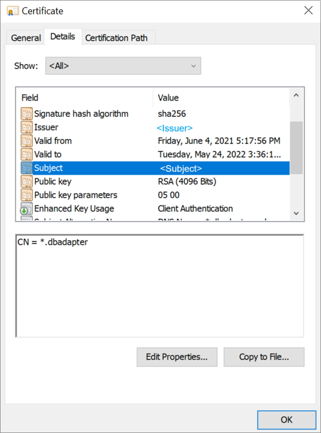
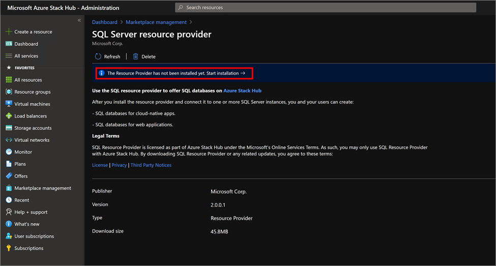
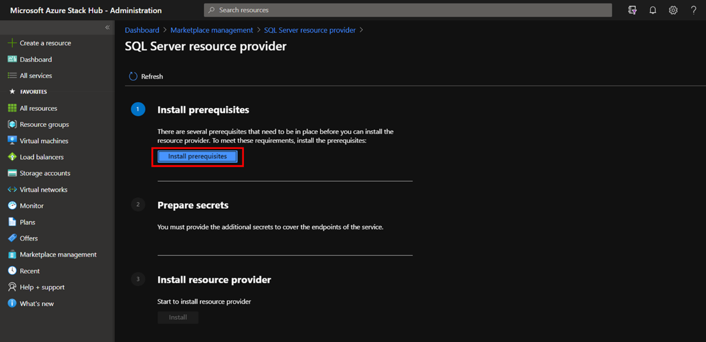
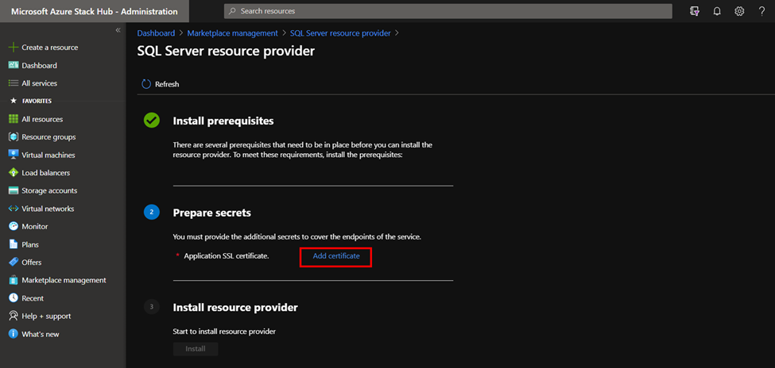
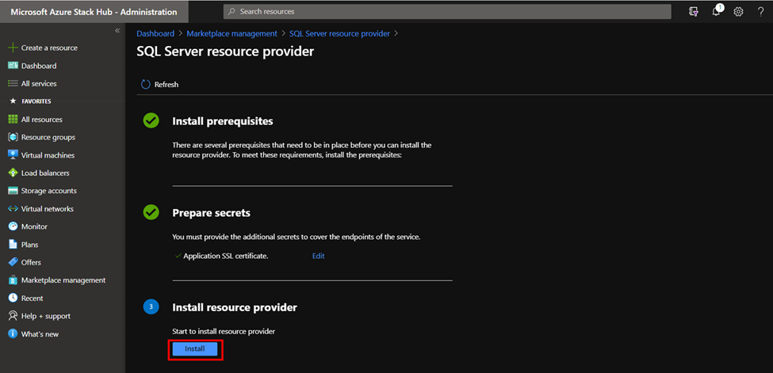
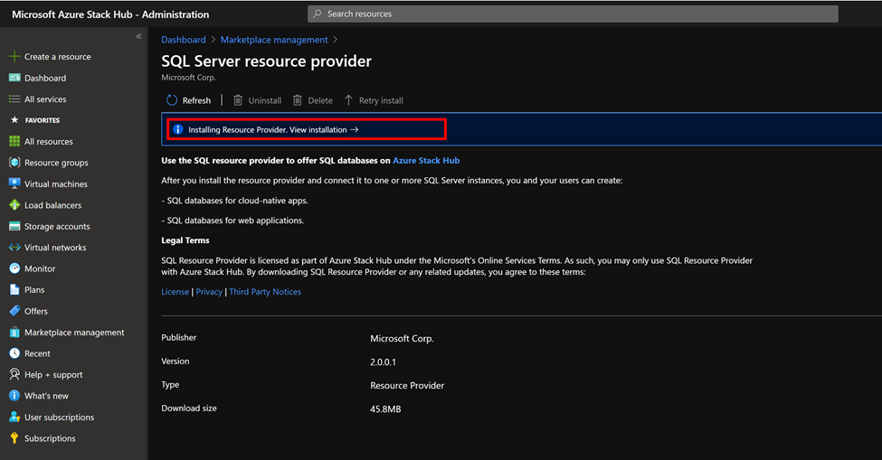
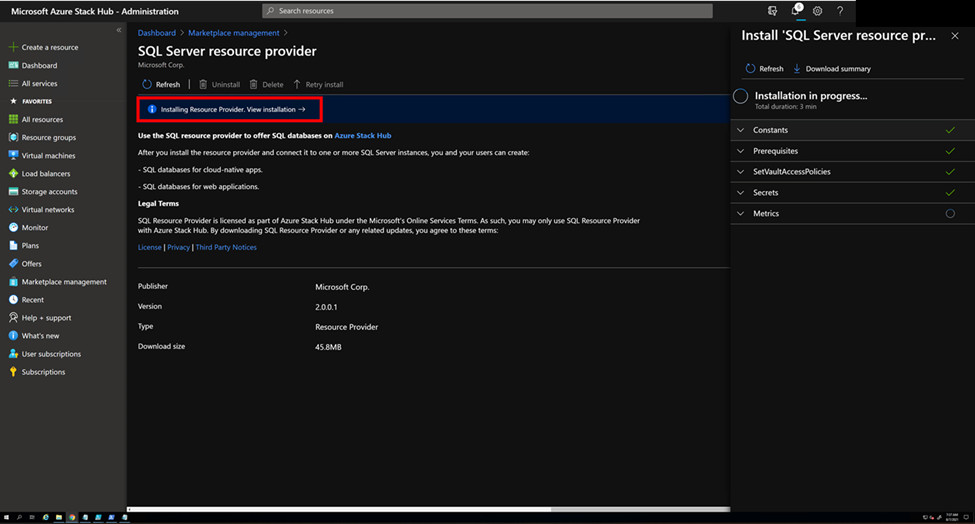

# Deploy the SQL Server resource provider on Azure Stack Hub

[!INCLUDE [preview-banner](../includes/sql-mysql-rp-limit-access.md)]

Use the Azure Stack Hub SQL Server resource provider to expose SQL databases as an Azure Stack Hub service. 
::: moniker range="<=azs-2008"
The SQL resource provider runs as a service on a Windows Server 2016 Server Core virtual machine.
::: moniker-end
::: moniker range=">=azs-2102"
The SQL resource provider runs as a service on a special Add-on RP Windows Server. 
::: moniker-end

> [!IMPORTANT]
> Only the resource provider should create items on servers that host SQL or MySQL. Items created on a host server that aren't created by the resource provider are unsupported, and may result in a mismatched state.

> [!IMPORTANT]
> The V2.x SQL/MySQL Resource Provider uses the Deployment Resource Provider (DRP) installation mechanism which isn't supported on ASDK. Therefore, the V2.x SQL/MySQL Resource Provider isn't supported on ASDK.

## Prerequisites

[!INCLUDE [Common RP prerequisites](../includes/resource-provider-prerequisites.md)]

## SQL Server resource provider prerequisites

- You'll need a computer and account that can access:
   - the [Azure Stack Hub administrator portal](azure-stack-manage-portals.md).
   - the [privileged endpoint](azure-stack-privileged-endpoint.md) (needed only when you're deploying SQL Server resource provider V1 or upgrading from SQL Server resource provider V1 to SQL Server resource provider V2).
   - the Azure Resource Manager admin endpoint, `https://adminmanagement.region.<fqdn>`, where `<fqdn>` is your fully qualified domain name.
   - the Internet, if your Azure Stack Hub was deployed to use Azure Active Directory (Azure AD) as your identity provider.

- Download the supported version of SQL resource provider binary according to the version mapping table below. For V2 SQL resource provider, [download the marketplace item to Azure Stack Hub](azure-stack-download-azure-marketplace-item.md).

  |Supported Azure Stack Hub version|SQL RP version|Windows Server that RP service is running on
  |-----|-----|-----|
  |2108, 2206|SQL RP version 2.0.6.x|Microsoft AzureStack Add-on RP Windows Server 1.2009.0
  |2108, 2102, 2008, 2005|[SQL RP version 1.1.93.5](https://aka.ms/azshsqlrp11935)|Microsoft AzureStack Add-on RP Windows Server|
  |     |     |     |

- Make sure that the required Windows Server VM is downloaded to Azure Stack Hub Marketplace. Manually download the image according to the version mapping table above if needed. 

- Ensure datacenter integration prerequisites are met:

    |Prerequisite|Reference|
    |-----|-----|
    |Conditional DNS forwarding is set correctly.|[Azure Stack Hub datacenter integration - DNS](azure-stack-integrate-dns.md)|
    |Inbound ports for resource providers are open.|[Azure Stack Hub datacenter integration - Ports and protocols inbound](azure-stack-integrate-endpoints.md#ports-and-protocols-inbound)|
    |PKI certificate subject and SAN are set correctly.|[Azure Stack Hub deployment mandatory PKI prerequisites](azure-stack-pki-certs.md)<br>[Azure Stack Hub deployment PaaS certificate prerequisites](azure-stack-pki-certs.md)|
    |     |     |

- Prepare the certificate. (_For integrated systems installations only_.) 
   - You must provide the SQL PaaS PKI certificate described in the optional PaaS certificates section of [Azure Stack Hub deployment PKI requirements](./azure-stack-pki-certs.md). The Subject Alternative Name (SAN) must adhere to the following naming pattern: CN=*.dbadapter.\<region\>.\<fqdn\>, with password protected.
      
   - When deploying SQL Server resource provider V1, place the .pfx file in the location specified by the **DependencyFilesLocalPath** parameter. Don't provide a certificate for ASDK systems.
   - When deploying SQL Server resource provider V2, prepare the certificate for the following installation steps.

### Disconnected scenario

When deploying SQL Server resource provider V2 in a disconnected scenario, follow the [download marketplace items to Azure Stack Hub](azure-stack-download-azure-marketplace-item.md) instruction to download the SQL Server resource provider item and Add-on RP Windows Server item to your Azure Stack Hub environment. 

When deploying SQL Server resource provider V1 in a disconnected scenario, complete the following steps to download the required PowerShell modules and register the repository manually.

1. Sign in to a computer with internet connectivity and use the following scripts to download the PowerShell modules.

   ```powershell
   Import-Module -Name PowerShellGet -ErrorAction Stop
   Import-Module -Name PackageManagement -ErrorAction Stop

   # path to save the packages, c:\temp\azs1.6.0 as an example here
   $Path = "c:\temp\azs1.6.0"
   ```

2. Depending on the version of resource provider that you are deploying, run one of the scripts.

   ```powershell
   # for resource provider version >= 1.1.93.0
   Save-Package -ProviderName NuGet -Source https://www.powershellgallery.com/api/v2 -Name AzureRM -Path $Path -Force -RequiredVersion 2.5.0
   Save-Package -ProviderName NuGet -Source https://www.powershellgallery.com/api/v2 -Name AzureStack -Path $Path -Force -RequiredVersion 1.8.2
   ```
   ```powershell
   # for resource provider version <= 1.1.47.0
   Save-Package -ProviderName NuGet -Source https://www.powershellgallery.com/api/v2 -Name AzureRM -Path $Path -Force -RequiredVersion 2.3.0
   Save-Package -ProviderName NuGet -Source https://www.powershellgallery.com/api/v2 -Name AzureStack -Path $Path -Force -RequiredVersion 1.6.0
   ```

3. Then you copy the downloaded packages to a USB device.

4. Sign in to the disconnected workstation and copy the packages from the USB device to a location on the workstation.

5. Register this location as a local repository.

   ```powershell
   # requires -Version 5
   # requires -RunAsAdministrator
   # requires -Module PowerShellGet
   # requires -Module PackageManagement

   $SourceLocation = "C:\temp\azs1.6.0"
   $RepoName = "azs1.6.0"

   Register-PSRepository -Name $RepoName -SourceLocation $SourceLocation -InstallationPolicy Trusted

   New-Item -Path $env:ProgramFiles -name "SqlMySqlPsh" -ItemType "Directory"
   ```

## Deploy the SQL resource provider V2

If you are upgrading from a V1 version, refer to the doc [Update the SQL Server resource provider](azure-stack-sql-resource-provider-update.md).

### Start installation

1. If you haven't already, sign in to the Azure Stack Hub administrator portal, select **Marketplace Management** on the left, select **Resource providers**.

2. Once SQL resource provider and other required software have been downloaded, **Marketplace Management** shows the "SQL Server resource provider" packages with a status of "Not Installed". There may be other packages that show a status of "Downloaded". 
   
 
3. Select the row you wish to install. The SQL Server resource provider install package page shows a blue banner across the top. Select the banner to start the installation.
   

### Install prerequisites

1. Next you're transferred to the install page. Select **Install Prerequisites** to begin the installation process.
   
 
2. Wait until the installation of prerequisites succeeds. You should see a green checkmark next to **Install prerequisites** before proceeding to the next step.
   

### Prepare secrets 

1. Under the **2. Prepare secrets** step, select **Add certificate**, and the **Add a certificate** panel will appear.
   

2. Select the browse button on **Add a certificate**, just to the right of the certificate filename field. Select the .pfx certificate file you procured when completing the prerequisites. 

4. Enter the password you provided to create a secure string for SQL Server resource provider SSL Certificate. Then select **Add**.
   

### Install resource provider

1. When the installation of the certificate succeeds, you should see a green checkmark next to **Prepare secrets** before proceeding to the next step. Now select the **Install** button next to **3 Install resource provider**.
   
 
2. Next you'll see the following page, which indicates that SQL resource provider is being installed.
   
 
3. Wait for the installation complete notification. This process usually takes one or more hours, depending on your Azure Stack Hub type. 
   

4. Verify that the installation of SQL Server resource provider has succeeded, by returning to the **Marketplace Management**, **Resource Providers** page. The status of SQL Server resource provider should show "Installed".
   

## Deploy the SQL resource provider V1

After you've completed all of the prerequisites, run the self-extractor to extract the downloaded installation package to a temporary directory. run the **DeploySqlProvider.ps1** script from a computer that can access both the Azure Stack Hub Azure Resource Manager admin endpoint and the privileged endpoint, to deploy the SQL resource provider. The DeploySqlProvider.ps1 script is extracted as part of the SQL resource provider binary that you downloaded for your version of Azure Stack Hub.

 > [!IMPORTANT]
 > Before deploying the resource provider, review the release notes to learn about new functionality, fixes, and any known issues that could affect your deployment.

To deploy the SQL resource provider, open a **new** elevated PowerShell window (not PowerShell ISE) and change to the directory where you extracted the SQL resource provider binary files. 

> [!IMPORTANT]
> We strongly recommend using **Clear-AzureRmContext -Scope CurrentUser** and **Clear-AzureRmContext -Scope Process** to clear the cache before running the deploy or update script.

Run the DeploySqlProvider.ps1 script, which completes the following tasks:

- Uploads the certificates and other artifacts to a storage account on Azure Stack Hub.
- Publishes gallery packages so you can deploy SQL databases using the gallery.
- Publishes a gallery package for deploying hosting servers.
- Deploys a VM using the Windows Server 2016 core image or Microsoft AzureStack Add-on RP Windows Server image you downloaded, and then installs the SQL resource provider.
- Registers a local DNS record that maps to your resource provider VM.
- Registers your resource provider with the local Azure Resource Manager for the operator account.

> [!NOTE]
> When the SQL resource provider deployment starts, the **system.local.sqladapter** resource group is created. It may take up to 75 minutes to finish the required deployments to this resource group. You should not place any other resources in the **system.local.sqladapter** resource group.

### DeploySqlProvider.ps1 parameters

You can specify the following parameters from the command line. If you don't, or if any parameter validation fails, you're prompted to provide the required parameters.

| Parameter name | Description | Comment or default value |
| --- | --- | --- |
| **CloudAdminCredential** | The credential for the cloud admin, necessary for accessing the privileged endpoint. | _Required_ |
| **AzCredential** | The credentials for the Azure Stack Hub service admin account. Use the same credentials that you used for deploying Azure Stack Hub. The script will fail if the account you use with AzCredential requires multi-factor authentication (MFA).| _Required_ |
| **VMLocalCredential** | The credentials for the local admin account of the SQL resource provider VM. | _Required_ |
| **PrivilegedEndpoint** | The IP address or DNS name of the privileged endpoint. |  _Required_ |
| **AzureEnvironment** | The Azure environment of the service admin account used for deploying Azure Stack Hub. Required only for Azure AD deployments. Supported environment names are **AzureCloud**, **AzureUSGovernment**, or if using a China Azure AD, **AzureChinaCloud**. | AzureCloud |
| **DependencyFilesLocalPath** | For integrated systems only, your certificate .pfx file must be placed in this directory. You can optionally copy one Windows Update MSU package here. | _Optional_ (_mandatory_ for integrated systems) |
| **DefaultSSLCertificatePassword** | The password for the .pfx certificate. | _Required_ |
| **MaxRetryCount** | The number of times you want to retry each operation if there's a failure.| 2 |
| **RetryDuration** | The timeout interval between retries, in seconds. | 120 |
| **Uninstall** | Removes the resource provider and all associated resources (see the following notes). | No |
| **DebugMode** | Prevents automatic cleanup on failure. | No |

## Deploy the SQL resource provider using a custom script

::: moniker range="<=azs-2005"
If you're deploying the SQL resource provider version 1.1.33.0 or previous versions, you need to install specific versions of AzureRm.BootStrapper and Azure Stack Hub modules in PowerShell. 
::: moniker-end

If you're deploying the SQL resource provider version 1.1.47.0 or later, the deployment script will automatically download and install the necessary PowerShell modules for you to path C:\Program Files\SqlMySqlPsh.

```powershell
# Install the AzureRM.Bootstrapper module, set the profile, and install the AzureStack module
# Note that this might not be the most currently available version of Azure Stack Hub PowerShell
Install-Module -Name AzureRm.BootStrapper -RequiredVersion 0.5.0 -Force
Use-AzureRmProfile -Profile 2018-03-01-hybrid -Force
Install-Module -Name AzureStack -RequiredVersion 1.6.0
```

> [!NOTE]
> In disconnected scenario, you need to download the required PowerShell modules and register the repository manually as a prerequisite.

To eliminate any manual configuration when deploying the resource provider, you can customize the following script. Change the default account information and passwords as needed for your Azure Stack Hub deployment.

```powershell
# Use the NetBIOS name for the Azure Stack Hub domain. On the Azure Stack Hub SDK, the default is AzureStack but could have been changed at install time.
$domain = "AzureStack"

# For integrated systems, use the IP address of one of the ERCS VMs
$privilegedEndpoint = "AzS-ERCS01"

# Provide the Azure environment used for deploying Azure Stack Hub. Required only for Azure AD deployments. Supported values for the <environment name> parameter are AzureCloud, AzureChinaCloud, or AzureUSGovernment depending which Azure subscription you're using.
$AzureEnvironment = "<EnvironmentName>"

# Point to the directory where the resource provider installation files were extracted.
$tempDir = 'C:\TEMP\SQLRP'

# The service admin account can be Azure Active Directory or Active Directory Federation Services.
$serviceAdmin = "admin@mydomain.onmicrosoft.com"
$AdminPass = ConvertTo-SecureString 'P@ssw0rd1' -AsPlainText -Force
$AdminCreds = New-Object System.Management.Automation.PSCredential ($serviceAdmin, $AdminPass)

# Set credentials for the new resource provider VM local admin account.
$vmLocalAdminPass = ConvertTo-SecureString 'P@ssw0rd1' -AsPlainText -Force
$vmLocalAdminCreds = New-Object System.Management.Automation.PSCredential ("sqlrpadmin", $vmLocalAdminPass)

# Add the cloudadmin credential that's required for privileged endpoint access.
$CloudAdminPass = ConvertTo-SecureString 'P@ssw0rd1' -AsPlainText -Force
$CloudAdminCreds = New-Object System.Management.Automation.PSCredential ("$domain\cloudadmin", $CloudAdminPass)

# Change the following as appropriate.
$PfxPass = ConvertTo-SecureString 'P@ssw0rd1' -AsPlainText -Force

# For version 1.1.47.0 or later, the PowerShell modules used by the RP deployment are placed in C:\Program Files\SqlMySqlPsh
# The deployment script adds this path to the system $env:PSModulePath to ensure correct modules are used.
$rpModulePath = Join-Path -Path $env:ProgramFiles -ChildPath 'SqlMySqlPsh'
$env:PSModulePath = $env:PSModulePath + ";" + $rpModulePath 

# Change to the directory folder where you extracted the installation files. Don't provide a certificate on ASDK!
. $tempDir\DeploySQLProvider.ps1 `
    -AzCredential $AdminCreds `
    -VMLocalCredential $vmLocalAdminCreds `
    -CloudAdminCredential $cloudAdminCreds `
    -PrivilegedEndpoint $privilegedEndpoint `
    -AzureEnvironment $AzureEnvironment `
    -DefaultSSLCertificatePassword $PfxPass `
    -DependencyFilesLocalPath $tempDir\cert

 ```

When the resource provider installation script finishes, refresh your browser to make sure you can see the latest updates and close the current PowerShell session.

### Verify the V1 deployment using the Azure Stack Hub portal

1. Sign in to the administrator portal as the service admin.
2. Select **Resource Groups**.
3. Select the **system.\<location\>.sqladapter** resource group.
4. On the summary page for Resource group Overview, there should be no failed deployments.
5. Finally, select **Virtual machines** in the administrator portal to verify that the SQL resource provider VM was successfully created and is running.

## Important configuration for Azure AD

If your Azure Stack Hub is using Azure AD as an identity provider, make sure the VM that has installed SQL Server resource provider has outbound internet connectivity. 

::: moniker range=">=azs-2108"
If there is a need to get the IP of the VM that has installed SQL Server resource provider (i.e. add the IP to your firewall allowlist), you need to [open a support case](azure-stack-help-and-support-overview.md) and have the support engineer make the SQL Server resource provider subscription temporarily visible. Then you can locate the VM in the subscription and get its IP.
::: moniker-end

## Next steps

[Add hosting servers](azure-stack-sql-resource-provider-hosting-servers.md)
