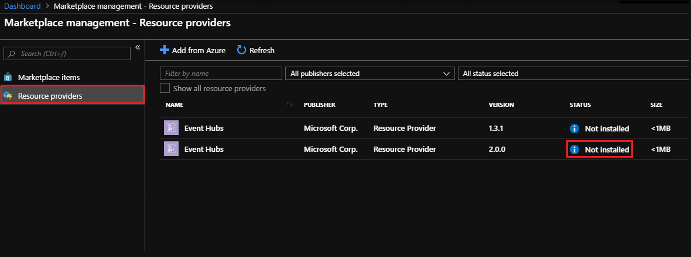
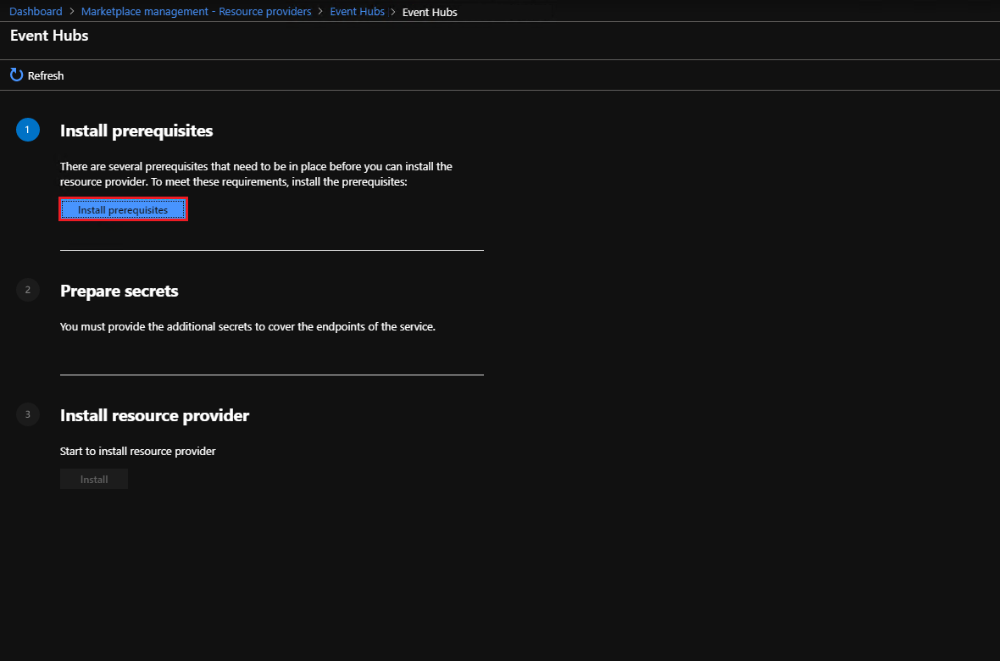
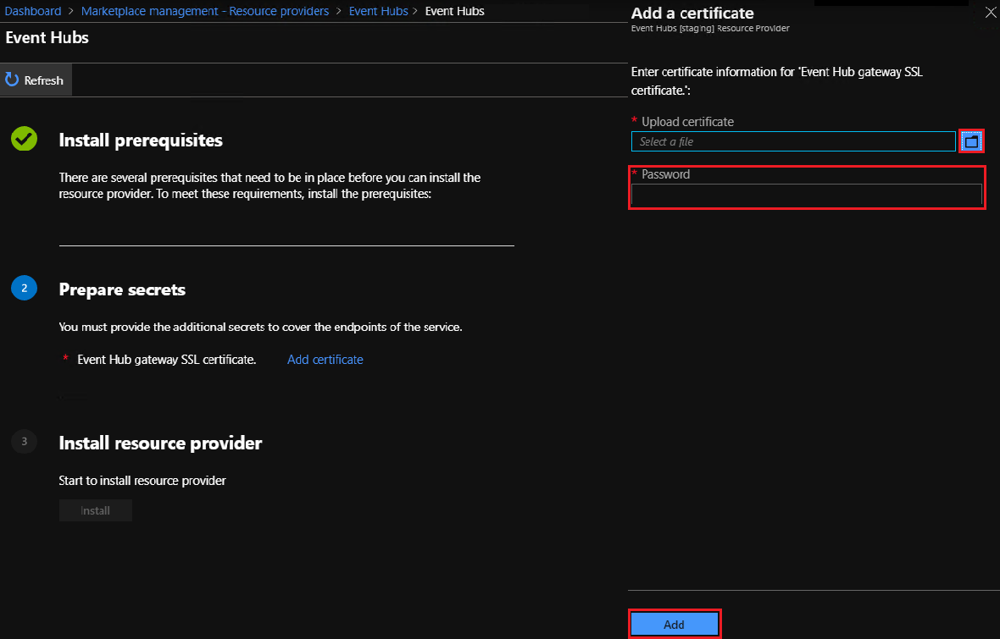
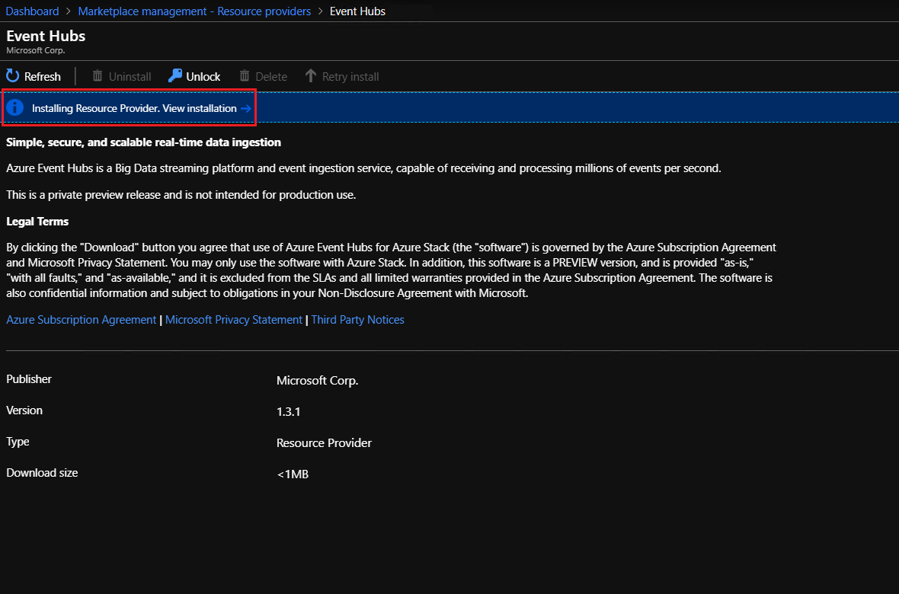

# How to install Event Hubs on Azure Stack Hub

This article shows you how to download and install the Event Hubs resource provider, making it available to offer to customers for subscription. You must also complete the [Event Hubs install prerequisites](event-hubs-rp-prerequisites.md) before continuing.

## Download packages

[!INCLUDE [prereqs](../includes/resource-provider-va-package-download-common.md)]

::: zone pivot="state-connected"
For a connected scenario, you download the items from Azure Marketplace directly to Azure Stack Hub Marketplace:

1. Sign in to the Azure Stack Hub administrator portal.
2. Select **Marketplace Management** on the left.
3. Select **Resource providers**.
4. Select **+ Add from Azure**.
5. Search for "Event Hubs" using the search bar.
6. Select the "Event Hubs" row on the search results. 
7. On the "Event Hubs" download page, select the Event Hubs version you wish to install, then select **Download** at the bottom of the page. 
   

Notice that additional software packages are downloaded along with Event Hubs, including:

- Microsoft Azure Stack Hub Add-On RP Windows Server INTERNAL ONLY
- PowerShell Desired State Configuration
::: zone-end

::: zone pivot="state-disconnected" 
[!INCLUDE [prereqs](../includes/resource-provider-va-package-download-disconnected.md)]
::: zone-end

## Installation 

1. If you haven't already, sign in to the Azure Stack Hub administrator portal, select **Marketplace Management** on the left, select **Resource providers**.
2. Once Event Hubs and other required software have been downloaded, **Marketplace Management** shows the "Event Hubs" packages with a status of "Not Installed". There may be other packages that show a status of "Downloaded". Select the "Event Hubs" row you wish to install.
   
 
3. The Event Hubs install package page shows a blue banner across the top. Select the banner to start the installation of Event Hubs.
   

### Install prerequisites

1. Next you're transferred to the install page. Select **Install Prerequisites** to begin the installation process.
   
 
2. Wait until the installation of prerequisites succeeds. You should see a green checkmark next to **Install prerequisites** before proceeding to the next step.

   

### Prepare secrets 

1. Under the **2. Prepare secrets** step, select **Add certificate**, and the **Add a certificate** panel will appear.
   

2. Select the browse button on **Add a certificate**, just to the right of the certificate filename field.
3. Select the .pfx certificate file you procured when completing the prerequisites. For more information, see [the installation Prerequisites](event-hubs-rp-prerequisites.md). 

4. Enter the password you provided to create a secure string for Event Hubs SSL Certificate. Then select **Add**.
   

### Install resource provider

1. When the installation of the certificate succeeds, you should see a green checkmark next to **Prepare secrets** before proceeding to the next step. Now select the **Install** button next to **3 Install resource provider**.
   
 
2. Next you'll see the following page, which indicates that Event Hubs resource provider is being installed.
   
 
3. Wait for the installation complete notification. This process usually takes one or more hours, depending on your Azure Stack Hub type. 
   

4. Verify that the installation of Event Hubs has succeeded, by returning to the **Marketplace Management**, **Resource Providers** page. The status of Event Hubs should show "Installed".
   

## Next steps

Before users can deploy Event Hubs resources, you must create one or more plans, offers, and subscriptions. 

- If this is the first time you're offering a service, start with the [Offer services to users](tutorial-offer-services.md) tutorial. Then continue with the next tutorial, [Test a service offering](tutorial-test-offer.md).
- Once you're familiar with the concept of offering a service, create an offer and plan that includes the Event Hubs resource provider. Then create a subscription for your users, or give them the offer information so they can create their own. For reference, you can also follow the series of articles under the [Service, plan, offer, subscription overview](service-plan-offer-subscription-overview.md).

To check for updates, [How to update Event Hubs on Azure Stack Hub](resource-provider-apply-updates.md).

If you need to remove the resource provider, see [Remove the Event Hubs resource provider](event-hubs-rp-remove.md)

To learn more about the user experience, visit the [Event Hubs on Azure Stack Hub overview](../user/event-hubs-overview.md) in the User documents.
