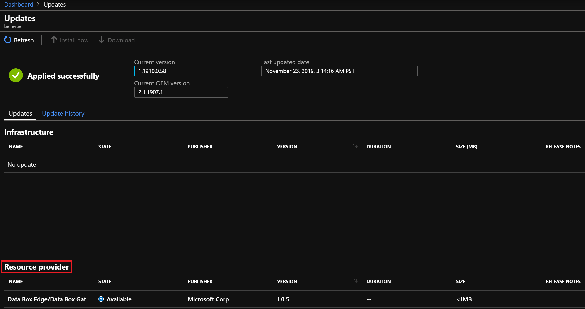

# How to update an Azure Stack Hub resource provider

> [!IMPORTANT]
> Before continuing, be sure to review the resource provider's latest release notes to learn about new functionality, fixes, and any known issues that could affect your deployment. The release notes may also specify the minimum Azure Stack Hub version required for the resource provider.

Resource providers installed from Marketplace will require regular servicing. Servicing is done by applying service updates, provided by Microsoft on a regular basis. Updates can include both new features and fixes.  

## Check for updates

Resource providers are updated using the same update feature that is used to apply Azure Stack Hub updates.

1. Sign in to the Azure Stack Hub administrator portal.
2. Select the **All services** link on the left, then under the **Administration** section select **Updates**.
   

3. On the **Updates** page, you find updates for the resource providers, under the **Resource Provider** section.

   

## Apply an update

If an update is available for a given resource provider:

1. Select the row of the resource provider you want to update. Notice the **Download** link at the top of the page becomes enabled.
   

2. Click the **Download** link to begin the download of the resource provider install package. Notice the **State** column for the resource provider row change from "Available" to "Downloading".
3. When the **State** changes to "Ready to install", the download is complete. Notice the **Install now** link at the top of the page also becomes enabled.
4. Select the **Install now** link and you're taken to the **Install** page for the resource provider. 
5. Select the **Install** button to begin the installation.
6. An "Installation in progress" notification will be shown in the upper right, and you return to the **Updates** page. The resource provider row **Status** column also changes to "Installing".
7. When installation is complete, another notification will indicate success or failure. A successful installation will also update the **Version** on the **Marketplace management - Resource providers** page.

## Next steps

Learn more about the [administrator dashboard updates feature](azure-stack-apply-updates.md).
