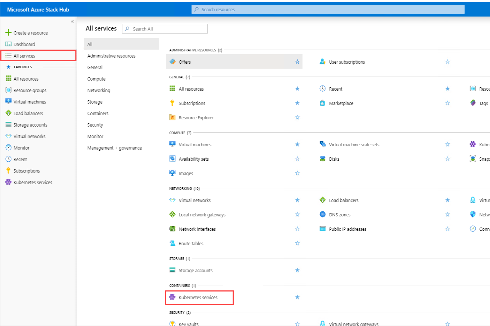
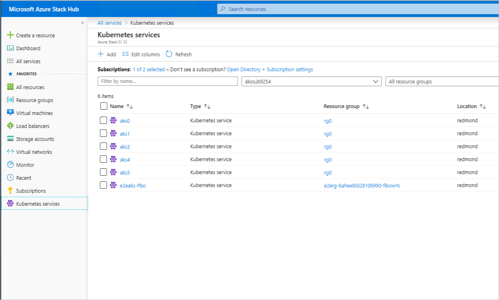
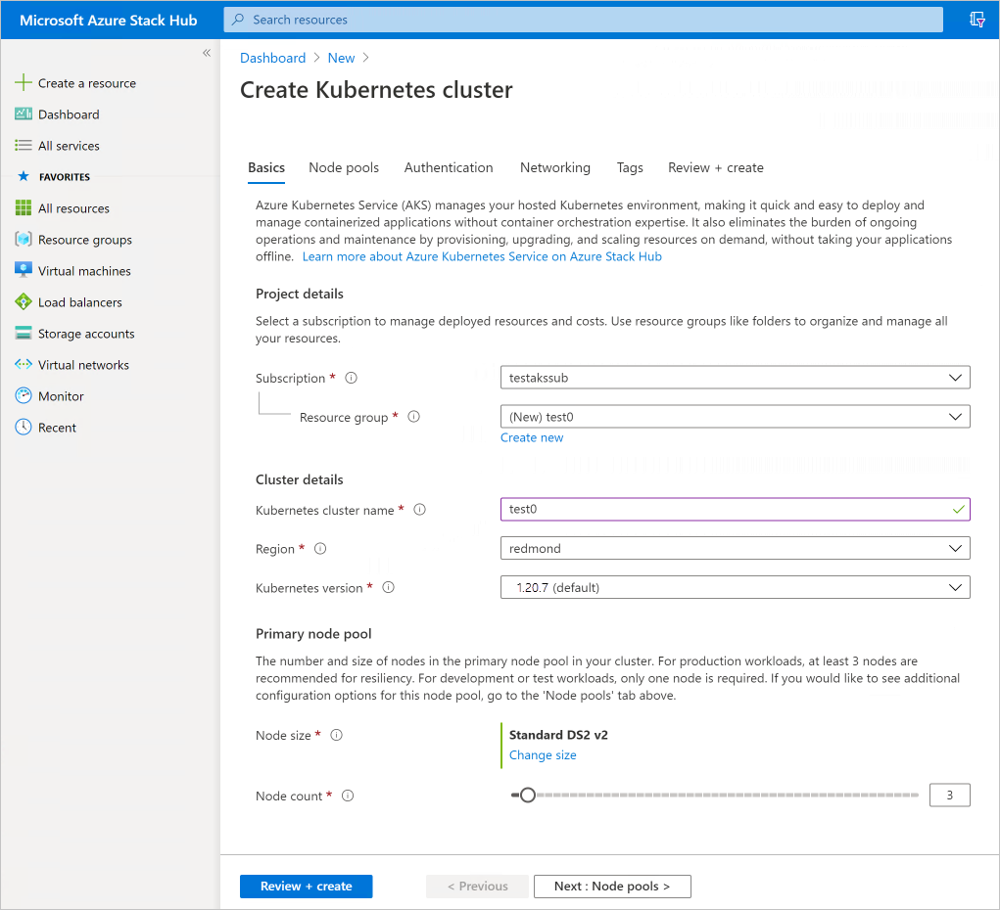
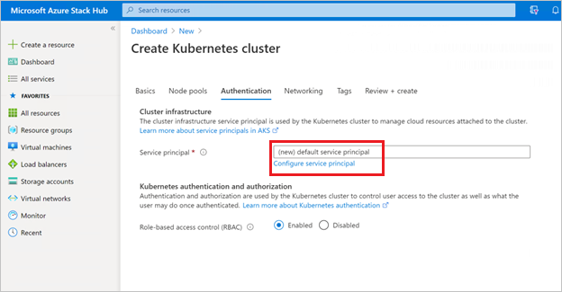
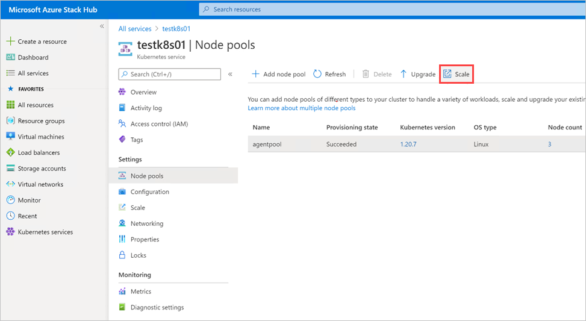
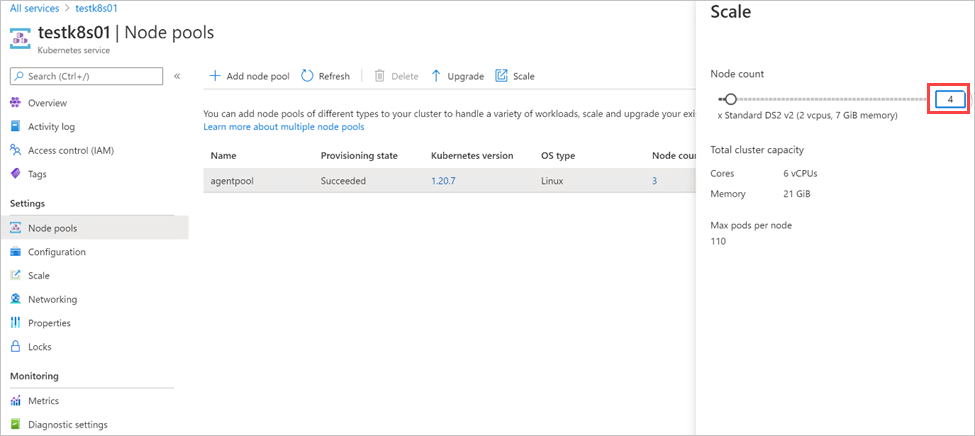
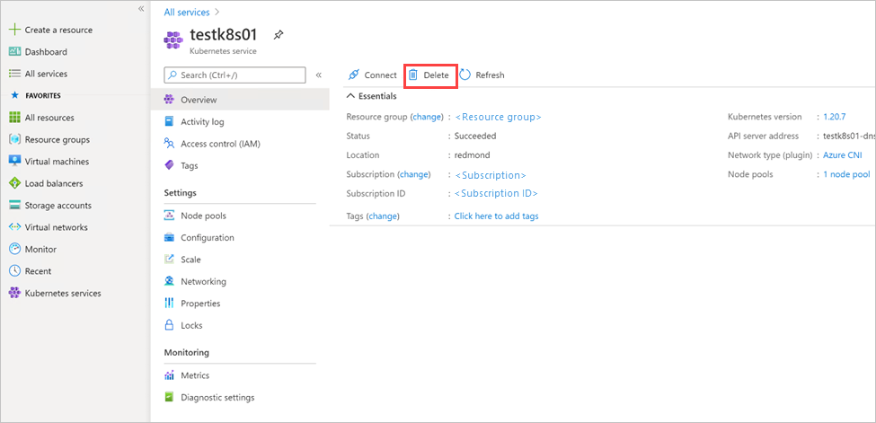

# Use Azure Kubernetes Service on Azure Stack Hub in the portal

You can use the Azure Stack Hub user portal, in the Azure Kubernetes Service (AKS), to discover, create, scale, upgrade, and delete AKS clusters.

## Verify your resource providers

You will need to have the `Microsoft.ContainerService` resource provider available for your subscription. To find the services available in your subscription:

1. Sign in to the Azure Stack user portal. Select **All services** > **Resource Explorer** in the **General** group.

    

2. In the **Resource Explorer**, find the `Microsoft.ContainerService`.

    

3. If your subscription doesn't have `Microsoft.ContainerService`, you will need to have your cloud operator add the resoruce provider to your subscription, or you will need to subscribe to a subscription with the provider. Contact your your cloud operator. 

    The cloud operator can use the Azure CLI connected to your environment to add the resource provider.
    1. You can find instructions on setting up [Azure CLI](aks-how-to-use-cli.md?tabs=ubuntu%2Clinuxcon#install-azure-cli).
    2. You can find the steps for adding `Microsoft.ContainerService` resource provider in [Use AKS CLI](aks-how-to-use-cli.md?tabs=windows%2Clinuxcon#connect-to-azure-stack-hub).
## Discover available AKS clusters

1.  In the Azure Stack tenant portal, find **All Services**, and select **Kubernetes services**.

    

1.  Verify that all clusters that you have created appear in **Kubernetes service**:

    

1.  Verify that you can view the details of any of the clusters:

    

## Create cluster

1.  In Kubernetes services, select **Add**.

    

1.  Follow the steps to create an AKS cluster. The first step collects the basic cluster properties:

    

    Use a version of Kubernetes 1.20 or greater. For more information, see [Applications deployed to AKS clusters fail to access persistent volumes](aks-known-issues.md#applications-deployed-to-aks-clusters-fail-to-access-persistent-volumes).

1.  In **Node pools** you can see that only a single node pool is allowed in Azure Stack Hub:

    

1. In **Authentication**, provide the service principal (SPN). The SPN won't be automatically generated as in Azure. Select the **Configure service principal** link and add the service principal. You can find [the instructions](../operator/give-app-access-to-resources.md) to create one.

    

1.  In **Networking**, select **Azure CNI**, and then continue to create the cluster.

    

## Scale cluster

1. In cluster details, select **Node pools**, then select the node pool and select **Scale**

    

2. In the scale panel on the right, select the new node count

    

## Delete cluster

1.  In the overview for the AKS cluster, find and select **Delete** as in the image below.

    

2.  Verify the cluster is deleted. Also, check that the associated resource group is deleted. In **Resource groups**, look for a resource group with the following pattern `<…>_clustername_location`. If a resource can't be found, it was properly deleted.

## Next steps

[Learn about AKS on Azure Stack Hub](aks-overview.md)