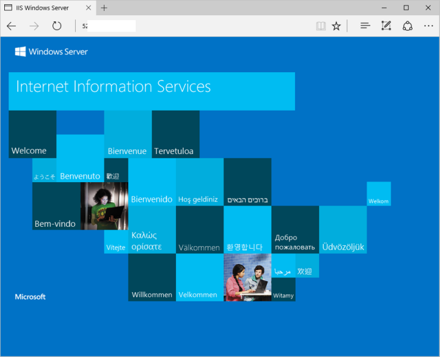

# Quickstart: Create a Windows Server virtual machine using Azure CLI in Azure Stack Hub

You can create a Windows Server 2016 virtual machine by using the Azure CLI. Follow the steps in this article to create and use a virtual machine. This article also gives you the following steps:

* Connect to the virtual machine with a remote client.
* Install the IIS web server and view the default home page.
* Clean up your resources.

## Prerequisites

* Make sure that your Azure Stack Hub operator added the **Windows Server 2016** image to the Azure Stack Hub Marketplace.

* Azure Stack Hub requires a specific version of Azure CLI to create and manage the resources. If you don't have Azure CLI configured for Azure Stack Hub, follow the steps to [install and configure Azure CLI](azure-stack-version-profiles-azurecli2.md).

## Create a resource group

A resource group is a logical container where you can deploy and manage Azure Stack Hub resources. From your Azure Stack Hub environment, run the [az group create](/cli/azure/group#az-group-create) command to create a resource group.

> [!NOTE]
>  Values are assigned for all the variables in the code examples. However, you can assign new values if you want to.

The following example creates a resource group named myResourceGroup in the local location:

```azurecli
az group create --name myResourceGroup --location local
```

## Create a virtual machine

Create a virtual machine (VM) by using the [az vm create](/cli/azure/vm#az-vm-create) command. The following example creates a VM named myVM. This example uses Demouser for an admin username and Demouser@123 as the admin password. Change these values to something that is appropriate for your environment.

```azurecli
az vm create \
  --resource-group "myResourceGroup" \
  --name "myVM" \
  --image "Win2016Datacenter" \
  --admin-username "Demouser" \
  --admin-password "Demouser@123" \
  --location local
```

When the VM is created, the **PublicIPAddress** parameter in the output contains the public IP address for the virtual machine. Write down this address because you need it to use the virtual machine.

## Open port 80 for web traffic

Because this VM is going to run the IIS web server, you need to open port 80 to internet traffic.

Use the [az vm open-port](/cli/azure/vm) command to open port 80:

```azurecli
az vm open-port --port 80 --resource-group myResourceGroup --name myVM
```

## Connect to the virtual machine

Use the next command to create a Remote Desktop connection to your virtual machine. Replace "Public IP Address" with the IP address of your virtual machine. When asked, enter the username and password that you used for the virtual machine.

```
mstsc /v <Public IP Address>
```

## Install IIS using PowerShell

Now that you've signed in to the virtual machine, you can use PowerShell to install IIS. Start PowerShell on the virtual machine and run the following command:

```powershell
Install-WindowsFeature -name Web-Server -IncludeManagementTools
```

## View the IIS welcome page

You can use a browser of your choice to view the default IIS welcome page. Use the public IP address listed in the previous section to visit the default page:



## Clean up resources

Clean up the resources that you don't need any longer. Use the [az group delete](/cli/azure/group#az-group-delete) command to remove the resource group, the virtual machine, and all related resources.

```azurecli
az group delete --name myResourceGroup
```

## Next steps

In this quickstart, you deployed a basic Windows Server virtual machine. To learn more about Azure Stack Hub virtual machines, continue to [Considerations for Virtual Machines in Azure Stack Hub](azure-stack-vm-considerations.md).
