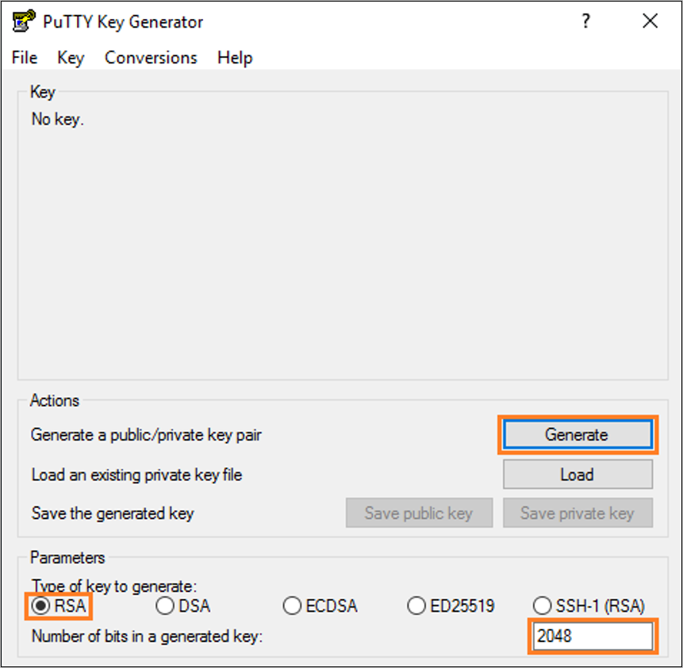
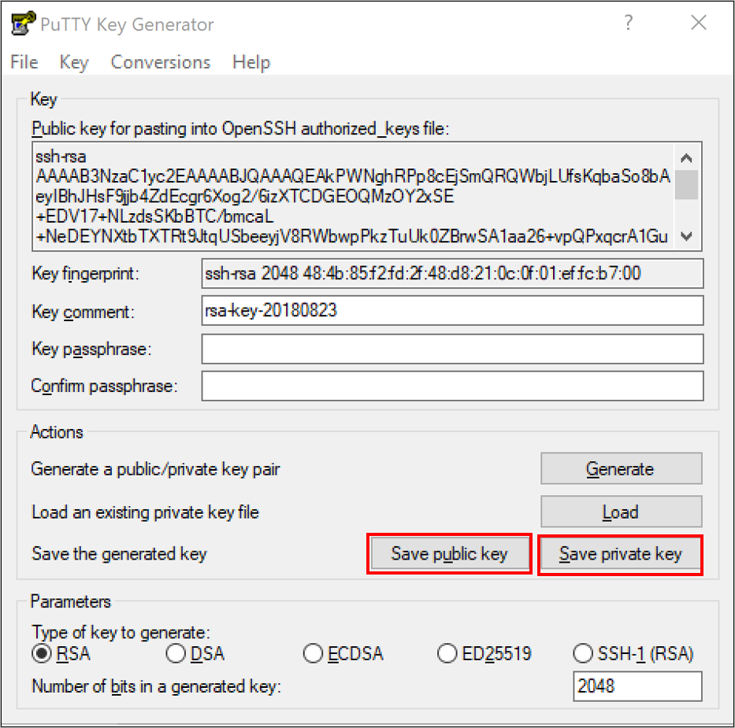
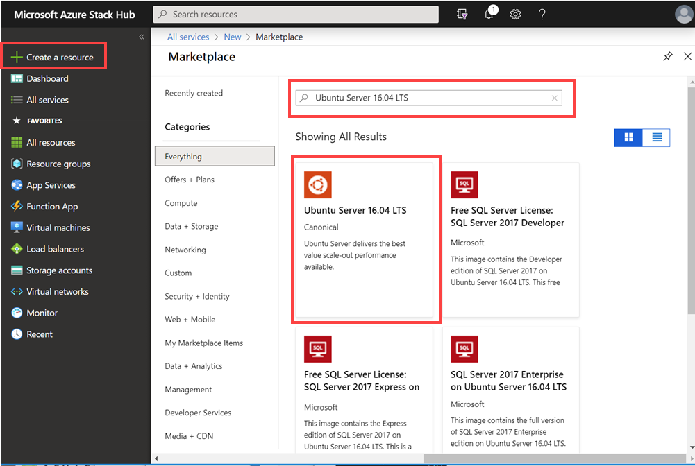
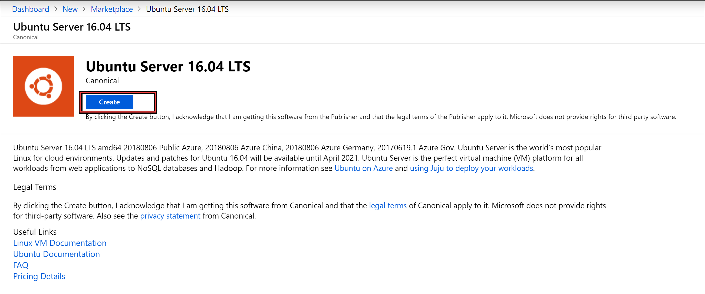
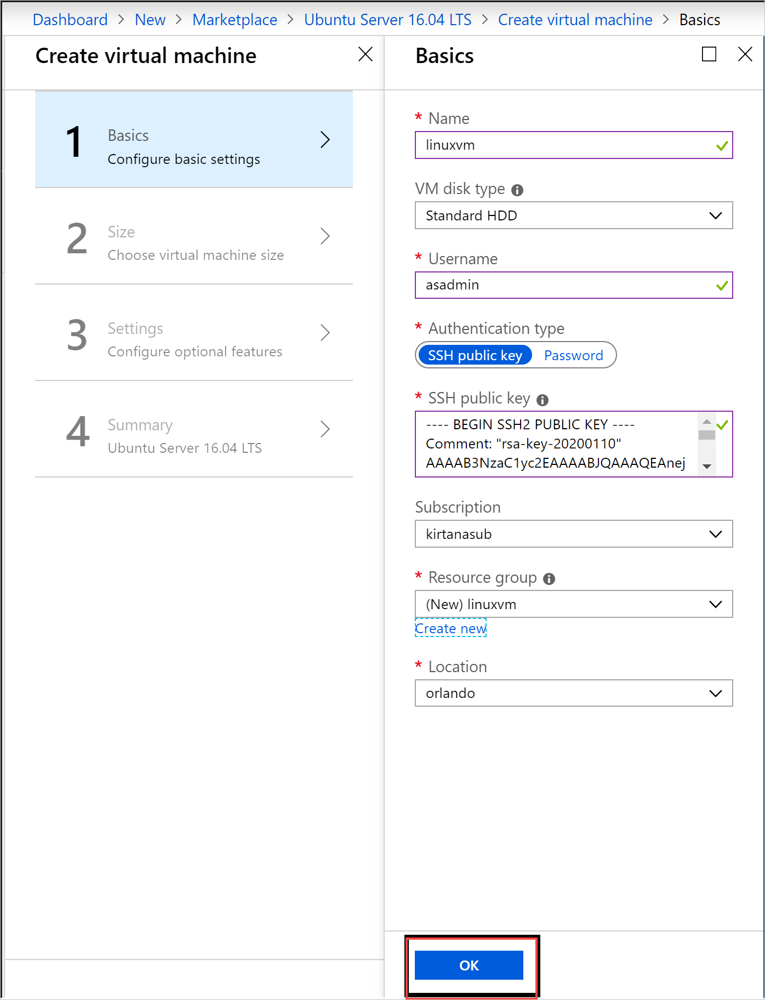
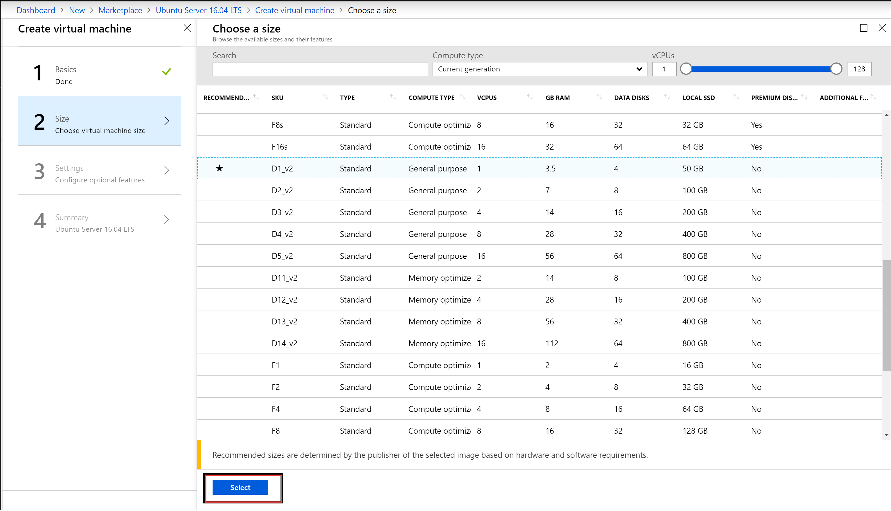
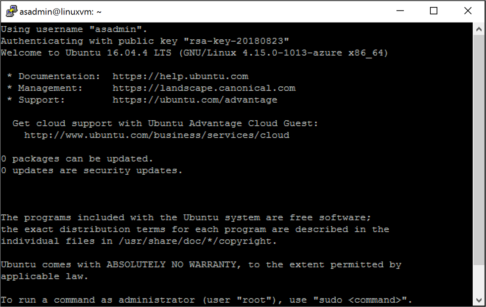
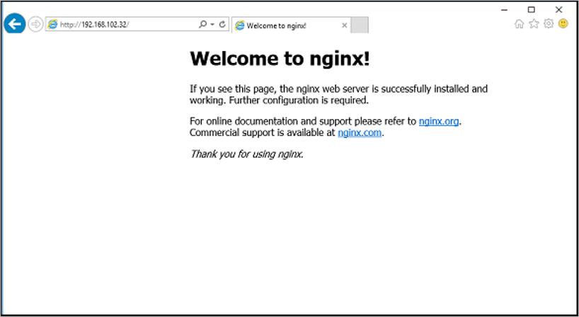

# Quickstart: Create a Linux server VM by using the Azure Stack Hub portal

You can create an Ubuntu Server 16.04 LTS virtual machine (VM) by using the Azure Stack Hub portal. In this article, you create and use a virtual machine. This article also shows you how to:

* Connect to the VM with a remote client.
* Install an NGINX web server.
* Clean up your resources.

> [!NOTE]  
> The images in this article are updated to match changes that were introduced in Azure Stack Hub version 1808. Version 1808 adds support for using *managed disks* in addition to unmanaged disks. If you're using an earlier version, images for some tasks, such as disk selection, differ from what's displayed in your UI.  

## Prerequisites

* A Linux image in the Azure Stack Hub Marketplace

   The Azure Stack Hub Marketplace, by default, doesn't have a Linux image. Have the Azure Stack Hub operator provide the Ubuntu Server 16.04 LTS image you need. The operator can use the instructions in [Download Marketplace items from Azure to Azure Stack Hub](../operator/azure-stack-download-azure-marketplace-item.md).

* Access to an SSH client

   If you're using the Azure Stack Development Kit (ASDK), you might not have access to a Secure Shell (SSH) client. If you need a client, several packages include an SSH client. For example, PuTTY includes an SSH client and SSH Key Generator (puttygen.exe). For more information about available packages, see [How to use an SSH public key](azure-stack-dev-start-howto-ssh-public-key.md).

* This quickstart uses PuTTY to generate the SSH keys and to connect to the Linux server VM. [Download and install PuTTY](https://www.putty.org).

## Create an SSH key pair

To finish all the steps in this article, you need an SSH key pair. If you already have an SSH key pair, you can skip this step.

To create an SSH key pair:

1. Go to the PuTTY installation folder (the default location is *C:\Program Files\PuTTY*) and run:

    `puttygen.exe`

1. In the **PuTTY Key Generator** window, set **Type of key to generate** to **RSA**, and set **Number of bits in a generated key** to **2048**.

   

1. Select **Generate**.

1. To generate a key, in the **Key** box, move the pointer randomly.

1. When the key generation has finished, select **Save public key**, and then select **Save private key** to save your keys to files.

   

## Sign in to the Azure Stack Hub portal

The address of the Azure Stack Hub portal depends on which Azure Stack Hub product you're connecting to:

* For the ASDK, go to `https://portal.local.azurestack.external`.

* For an Azure Stack Hub integrated system, go to the URL that your Azure Stack Hub operator provided.

## Create the VM

1. Select **Create a resource** > **Compute**. Search for `Ubuntu Server 16.04 LTS`. Select the name.

   

1. Select **Create**.

   

1. Enter the VM information. Select **SSH public key** for Authentication type, and paste the SSH public key that you saved, and then select **OK**.

    > [!NOTE]  
    > Make sure that you remove any leading or trailing white space for the key.

   

1. Select **D1_v2** for the VM size.

   

1. Enter your changes to the defaults on the **Settings** blade,  Use Managed disks. If you need to allow SSH access, select **SSH (22)** to open the port. When your configurations are ready, select **OK**.

   

1. Select **OK** in the Summary to start the VM deployment. Select **Virtual Machines** to see your new VM, search for the VM name, and then select the VM in the search results.


## Connect to the VM

1. Select **Connect** on the VM page. You can find the SSH connection string that you need to connect to the VM. 

1. On the **PuTTY Configuration** page, in the **Category** pane, scroll down to and expand **SSH**, and then select **Auth**. 

   

1. Select **Browse**, and then select the private key file that you saved.

1. In the **Category** pane, scroll up to and select **Session**.

1. In the **Host Name (or IP address)** box, paste the connection string that's shown in the Azure Stack Hub portal. In this example, the string is *asadmin@192.168.102.34*.

1. Select **Open** to open a session for the VM.

   

## Install the NGINX web server

To update package sources and install the latest NGINX package on the VM, enter the following bash commands:

```bash
#!/bin/bash

# update package source
sudo apt-get -y update

# install NGINX
sudo apt-get -y install nginx
```

When you finish installing NGINX, close the SSH session and open the VM **Overview** page in the Azure Stack Hub portal.

## Open port 80 for web traffic

A network security group (NSG) secures inbound and outbound traffic. When a VM is created in the Azure Stack Hub portal, an inbound rule is created on port 22 for SSH connections. Because this VM hosts a web server, an NSG rule needs to be created to allow web traffic on port 80.

1. On the VM **Overview** page, select the name of the **Resource group**.

1. Select the **network security group** for the VM. You can identify the NSG by using the **Type** column.

1. In the left pane, under **Settings**, select **Inbound security rules**.

1. Select **Add**.

1. In the **Name** box, type **http**. 

1. Make sure that **Port range** is set to 80 and **Action** is set to **Allow**.

1. Select **OK**.

## View the Welcome to nginx page

With NGINX installed and port 80 open on your VM, you can access the web server by using the VM's public IP address. (The public IP address is shown on the VM's **Overview** page.)

Open a web browser, and go to *http://\<public IP address>*.



## Clean up resources

Clean up the resources that you don't need any longer. To delete the VM and its resources, select the resource group on the VM page, and then select **Delete**.

## Next steps

In this quickstart, you deployed a basic Linux server VM with a web server. To learn more about Azure Stack Hub VMs, continue to [Considerations for VMs in Azure Stack Hub](azure-stack-vm-considerations.md).
